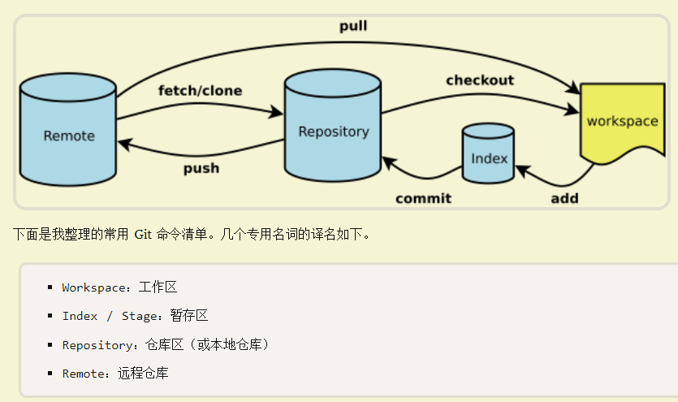

# cmd

- 创建一个文件夹 `md 目录名`
- cd
-   删除一个文件夹 `rmdir /s/q  目录名`
- 列出当前目录下的所有文件 `dir`

# windows 环境变量

可以将一些常用的文件或程序的路径添加到path下,这样我们就可以在任意位置来访问这些文件了。

# 常用Git命令



- [GitHub Doc](https://docs.github.com/cn/get-started/using-git/pushing-commits-to-a-remote-repository)


[操作](https://docs.github.com/cn/get-started/using-git/pushing-commits-to-a-remote-repository)

- `git fetch` - **仅查看远程变动**
  1. `--all` - 拉取覆盖本地
- `git pull remote_name branch_name` - **拉取更改**
- `git merge --abort` **将分支恢复到您拉取之前的状态**


- `git add [file | path]` - **建立本地历史快照**
  
  1. `-A`     提交所有变化
  2. `-u`     提交被 修改/删除 的文件，不包括新文件
  3. `. `       提交 新文件/修改 的文件，不包括被删除的文件
  
- `git commit [file | path | null]` - **正式提交**
  
  1. `-v` - 如提交时显示diff信息
  2. `-m "注释"` - 注释
  
- `git push <remote_name > <branch_name> `  - **推送正式提交**

  1. `-u` 同步

  > git push -u origin master - 推送到远程分支
  >
  > git push origin  - 推送至全部
  
- `git push origin main --force` - 覆盖远程

  1. `-f` 

- [回滚](https://zhuanlan.zhihu.com/p/137856034)

  1. `git reset --hard HEAD^` - 上一个版本

推送流程

git add -A
git commit -m ""
git push -u origin main

[仓库管理](https://docs.github.com/cn/get-started/getting-started-with-git/managing-remote-repositories)

- `git init` - 初始化
- `git clone [REPO URL]` - 克隆
- `git branch -a` - 列出分支
- `git branch -m <new_name>` - 重命名**本地**分支
- `git origin <本地分支>:<new_name>` - 重命名**远程**分支
- `rm -r .git` - 取消本地存储库
- `git remote`
  1. `-v` - 查看关联状态
  2. `add [any_remote_name] [REPO URL]` - 关联远程仓库
  3. `rm [name]` - 取消关联仓库

配置

- `git config --global --list` - 全局配置信息
- `git config [any]`

SSH

- `ssh-keygen -t rsa` - 生成
- `ssh -T git@github.com` - 在github验证是否存在
- `ssh -T -p 443 git@ssh.github.com`

.gitignore

- `touch .gitignore` 
- `git status`

```
target          //忽略这个target目录
angular.json    //忽略这个angular.json文件
log/*           //忽略log下的所有文件
css/*.css       //忽略css目录下的.css文件
```


# [npm](https://segmentfault.com/a/1190000012099112)

- 删除依赖 `uninstall`
- 初始化 `init`
- 更新包 `update`
- 安装 `<install | i>`
- 删除 `r`
- 模块版本 `version`
- 网络搜索包`search`
- 镜像切换 `config set registry=`地址

> 镜像

- [官方](https://registry.npmjs.org/)
- [阿里镜像站](https://developer.aliyun.com/mirror/?spm=a2c6h.13651102.0.0.5bbc1b11Doi1G6&serviceType=mirror&tag=%E8%AF%AD%E8%A8%80)
  npm set registry http://registry.npmmirror.com


## package.json


# node

- 安装类型定义`npm i --save-dev @types/node`

### [devtool调试](https://nodejs.org/en/docs/guides/debugging-getting-started/)

- node --inspect ts-node/register src/index.ts

- 谷歌浏览器输入:

  > chrome://inspect/
  
- 配合`nodemon工具` 

  1. nodemon -e ts --exec node --inspect -r ts-node/register ./src

> [无法加载来源映射解决](https://www.lmcc.top/articles/414.html)

# Electron

-   安装electron `npm install electron --save-dev`

# ts-node

- 依赖`npm i -g typescript`
- 安装`npm install -g ts-node`
- 安装类型定义`npm install -D tslib @types/node`

#### [使用ESM构建](https://www.ruanyifeng.com/blog/2020/08/how-nodejs-use-es6-module.html)

> package.json 中已添加 `"type": "module"`
> tsconfig.json 中已添加 `"module": "ESNext"`

自动搜寻tsconfig.json

> 安装 `npm i tsconfig-paths -g`
> `ts-node -r tsconfig-paths/register index.ts --files`

# ts-node-dev

结合[node-dev](https://github.com/fgnass/node-dev)和[ts-node](https://github.com/TypeStrong/ts-node)的选项

- `npm install -g ts-node-dev`

```
tsnd --respawn index.ts
```

# nodemon

- npm install -g nodemon

```
nodemon --exec " ts-node " ./index.ts
nodemon -e ts --exec ts-node ./bin/www
nodemon -e ts --exec ts-node -r tsconfig-paths/register --files ./index.ts
```

- `-e`：表示指定观察列表 (Specifying extension watch list)
- `--exec`：代表命令行形式执行命令

# tsc

- npm i -g typescript

```
tsc --init
tsc -w
```

# Express

# mongoose

# sass

`npm i sass`

- sass --watch --style compressed ./src:./dist

# nvm

[node版本管理工具](https://cloud.tencent.com/developer/article/1409081)
