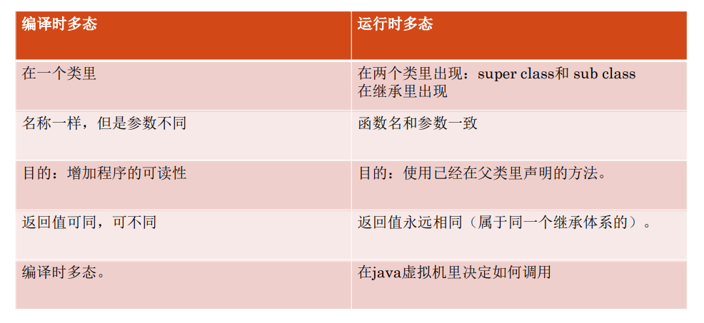
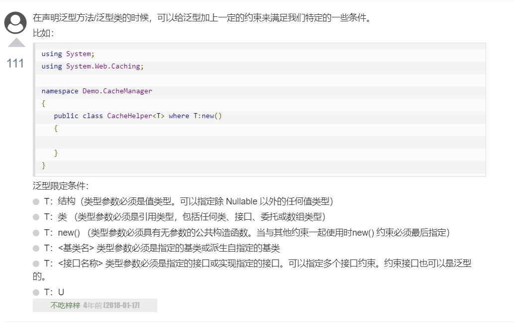

C#

## 动态（Dynamic）类型

- **运行时类型检查**
- `dynamic <variable_name> = value;`

## @

- string 字符串的前面可以加 @（称作"逐字字符串"）将转义字符（\）当作普通字符对待;`@"runoob.com";`

  类似js" `` "


## out    ref

- out、ref都是引用传递，传递后使用都会改变原有的值
- out是只出不进。ref是有进有出

## ReadLine()

- **`Console.ReadLine()`** 接收来自用户的输入

## 可空类型

- 无法直接赋值为 null 的数据类型进行 null 的赋值

  ```csharp
  int? i = null ?? null;
  //==
  Nullable<int> i = new Nullable<int>(3);
  ```

  > **nullable** 类型 - 基于其他类型再额外加一个null类型
  >
  > "? "同上
  > "??"  左为null时则取右

## 部分关键字介绍

#### **`delegate` - 委托**

- **除了主体以外其他须一致**

  ```csharp
  delegate void A();
  void B();
  void C();
  A a = B;
  a += C;
  a();//调用了A和B方法
  ```

#### `readonly` - 只读

- 与`const`区别: const修饰时引用不能更改,   readonly修饰时全部不能更改

#### `sealed` - **密封**

- 对类修饰时，该类不能被继承
- 对方法修饰时，该方法不能被覆盖
- 抽象类不能声明为sealed

#### `abstract` - **抽象类**<a id="/abstract"></a>

- 用于提供接口的部分类的实现 (派生类继承自该抽象类时 需实现应该抽象对象)

- 不能为实例, 不能在abstract类外部定abstract对象

- 适用于只有少数方法由基类声明由派生类实现时

> (与TypeScript的`interface`类似) - **规定部分形状**

#### `virtual` - **虚拟方法**<a id="/virtual"></a>

- 当类中的函数需要在继承类中实现时

#### **[`override`](https://docs.microsoft.com/zh-cn/dotnet/csharp/language-reference/keywords/override)** - 覆盖<a id="/override"></a>

- `override` 方法必须具有与重写基方法相同的签名
- 重写基方法必须是 `virtual`、`abstract` 或 `override`。
- 不能更改 `virtual` 方法的可访问性。
- `override <Type> Func`

#### `struct` - **结构体**

- 结构可带有 方法、字段、索引、属性、运算符方法和事件。
- 相当于简化版的类


~~~csharp
struct Key
{
public string name;
public Key(string name){this.name = name}//构造函数
}; 
```
Key A; Key A = new Key();
A.id = '1'
```
~~~

> (与TypeScript的`interface`类似) - **定义结构**

#### `namespace` - 命名空间

- namespace <namespace_name>{}

#### `using` - 使用命名空间

- using <namespace_name>; (类似js导入文件)

- 重写命名空间上的实例

  ```csharp
  using namespace_name;
  namespace namespace_name{
      //code对应该空间对象
      //命名空间可嵌套
  }
  ```

#### `static` - [**静态**](https://www.cainiaojc.com/csharp/csharp-static.html)

- 无法被实例化
- 静态函数属于类
- 静态类**不能包含**实例成员和构造函数
- 静态类是密封类，因此**不能被继承**
- ...

#### `base` - 访问基类成员

-  **调用基类构造函数** - `派生构造函数():base(){}`
-  派生类中**调用基类的方法** - `base.func();`

> 用于从派生类中访问基类的成员
>
> 类似java和js中的super

------

# class

## 构造函数

- C#类中的**构造函数** 与 js类的 `constructor()` 非常相似
- **与类名相同，无返回类型;**  `public ClassName(){}`
- 当创建类的新对象时执行
- `base` - 父类构造函数

## 析构函数

- 类名前加(~)作为前缀,; `~ClassName(){}`
- 无返回值, 不带参,无法继承或重载, 无修饰符
- 当对象无用时由垃圾回收器调用(如关闭文件、释放内存)

## 基类和派生类

```csharp
<访问修饰符> class <基类>{}
class <派生类> : <基类>{}
```

## 拟多重继承

- **不支持多重继承**
- **可以使用接口来实现多重继承**

```csharp
class A{}
interface Shape{}
class B:A,Shape{}
```

------

# 静态多态性

`编译时多态`

## 函数重载

- 对**同作用域同名函数的不同定义**

- 不能重载只有返回类型不同的函数声明。

  ```csharp
  public class TestData  
  {  
      public int Add(int a, int b, int c) { }  
      public int Add(int a, int b)  { }  
  } 
  ```

  > 同名不同参或类型的函数; - **函数重载**
  >
  > **`调用同名函数但实参不同,将使用不同函数`**

## 运算符重载*




------

# 动态多态性

`运行时多态`

[override](#/override) - [abstract](#/abstract ) - [virtual](#/virtual)

> 动态多态性是通过关键字 **抽象类** 和 **虚方法** 实现的。

------

## 文件*

## Interface

- 接口声明默认是 public 的

- 继承接口后，我们需要实现接口的属性

  具有主体的方法可不实现

> 抽象类在某种程度上与接口类似, 但是是们大多用在只有少数方法由基类声明由派生类实现时;
> (与TypeScript的`interface`非常类似)

> 可以实例化继承该接口的类为该接口的实例 `接口 xx = new class()`

1. 扩展接口

   ```csharp
   public interface IInterface{ }
   public static class ClassName
   {
       public static void Foo<T>(this T Target, string parameter) where T:IInterface
       {
           Console.WriteLine(Target);
           Console.WriteLine(parameter);
       }
   }
   ```

2. [接口方法, 重写, 子调用父方法](https://www.cnblogs.com/ittranslator/p/13838092.html#%E6%8E%A5%E5%8F%A3%E4%B8%AD%E7%9A%84%E5%85%B7%E4%BD%93%E6%96%B9%E6%B3%95)

## [扩展方法](https://www.cainiaojc.com/csharp/csharp-extension-method.html)

- 扩展实现**需是静态形式**(static)

- 扩展方法  `func(<this Target>,< 形参 >)`

  > 有些类似js中往原型内添加属性

```csharp
//定义
public static class ClassName
{
    public static void Foo(this int i,string parameter) {
        Console.WriteLine(i);//目标值
        Console.WriteLine(parameter);
    }
}
//使用
int n = 0;
n.Foo("parameter")
```


## 特性（[Attribute](https://www.cnblogs.com/hyddd/archive/2009/07/20/1526777.html)）

1. **特性（Attribute）**是用于在运行时传递程序中各种元素（比如类、方法、结构、枚举、组件等）的行为信息的声明性标签。**声明性标签"[ ]"**。
2. **Attribute的目的是为元素提供关联附加信息**

`System.Attribute类`

- Obsolete - **过时的荒废的**

  ```csharp
  [Obsolete(<WarningMessage>,<Bool-iserror>)]
  ```

- Conditional - **条件方法**

  > 依赖于指定的预处理标识符
  > 它会引起方法调用的条件编译，取决于指定的值，比如 **Debug** 或 **Trace**

  ```csharp
  #define DEBUG
  [Conditional("DEBUG")]
  ```

- AttributeUsage

  > 描述了如何使用一个**自定义**特性类

  ```csharp
  [AttributeUsage(
  validon = <AttributeTargets.All>,//默认all//允许反射过去的特性对象
  AllowMultiple = <bool>,//单双用?
  Inherited = <bool>//可继承?
  )]
  //validon
  /*  AttributeTargets.Class |
  AttributeTargets.Constructor |
  AttributeTargets.Field |
  AttributeTargets.Method |
  AttributeTargets.Property  */
  ```

`自定义 attribute`

- [拥有Attribute特性类的类名()]

  ```csharp
  [AttributeUsage(AttributeTargets.All)]//反射特性规则//属性用法
  class MyAttribute : System.Attribute{}
  //自定义 attribute
  [MyAttribute("Hello World...")]//(构造函数,字段=xx.字段=xx,...)
  public class SomeClass{}
  ```

## 反射（Reflection）

- [获取 访问器, 字段, 属性, 方法](https://segmentfault.com/a/1190000022032802)

- [获取特性](https://www.cnblogs.com/hyddd/archive/2009/07/20/1526777.html)

  ```csharp
  MemberInfo memberInfo = typeof(SomeClass);
  object[] attributes = memberInfo.GetCustomAttributes(true);
  foreach (object attr in attributes)
  {
      MyAttribute attribute = attr as MyAttribute;//MyAttribute某类
      Console.WriteLine(attribute.Text);
  }
  ```

  > 并不局限于拥有System.Attribute的类
  >
  > https://blog.csdn.net/weixin_43112045/article/details/111296831

## 索引器

- 允许一个对象可以像数组一样使用下标的方式来访问`"this[type indexName]{}"`

```csharp
class IndexedNames
{
    public string this[string index] { get => index; set => index = value; }
    public int this[int index]{...}//重载
}
```

## 委托


## 泛型（Generic）

- 与Type（Generic）Script中的泛型非常类似

- 可定义: 方法,特性,索引,事件

- ```csharp
  //C#
  interface Shape<A,B>
  {
      A Foo();
  }
  class MyClass : Shape<int,string>
  {
      public int Foo()
      {
          return 1;
      }
  }
  ```

  

## 元组Tuple 和 ValueTuple（值元组）

```csharp
//ValueTuple
var person = (1, "Steve");
(int, string) person = (1, "Steve");
(int Id, _) person = (1, "Bill");//优先左侧名称//"_"丢弃成员
person.Item1; // 返回 1
person.Id; // 返回 1
```

> 普通元组最多只能包含八个元素
> **ValueTuple 可以包含八个以上的值。**

## 转型

如果ClassB继承了ClassA;

- `ClassA a = new ClassB();` 子向父转型 == `向上转型`(就是**禁用**子类这个版本)
- `(ClassB)a;` //`向下转型` == 解除禁用子类这个版本(前提是向上转型过的)

> 就是类型转换

## 协变式返回

- **定义:** 被重写的函数返回类型不必一样 *(适用于引用类型)*
