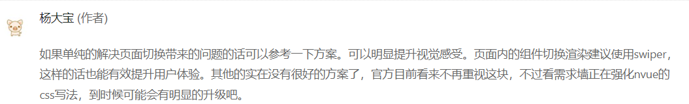
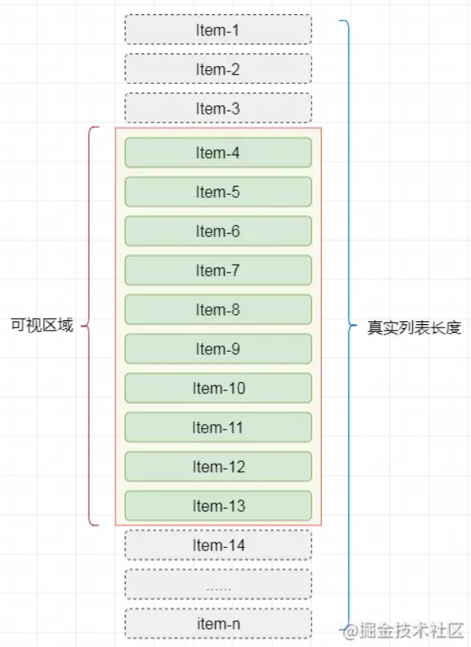

# 页面切换



```js
//预加载（仅安卓）增强用户体验  
// #ifdef APP-PLUS  
let preTimeOut = 0;  
if (plus.os.name.toLowerCase() == "android") {  
    const navigateTo = uni.navigateTo;  
    uni.navigateTo = function(params) {  
        params.animationType = "slide-in-right";  
        params.animationDuration = 150;  
        uni.preloadPage({  
            url: params.url,  
            complete: () => {  
                clearTimeout(preTimeOut);  
                preTimeOut = setTimeout(function() {  
                    navigateTo(params)  
                    uni.unPreloadPage({  
                        url: params.url  
                    })  
                }, 200)  
            }  
        })  
    }  
}  
// #endif
```

- https://ask.dcloud.net.cn/question/96021

# [weex-v-show插件](https://ext.dcloud.net.cn/plugin?id=3662#rating)

# 长列表优化

## [虚拟列表](https://juejin.cn/post/6844903982742110216#heading-2)

- 其实是按需显示的一种实现，

  即只对`可见区域`进行渲染，对`非可见区域`中的数据不渲染或部分渲染的技术，从而达到极高的渲染性能。



## 虚拟滚动

## 分页

- ​	参考QQ聊天群的下拉查看更多消息

## CSS方式

​	参考:` content-visibility: auto;`