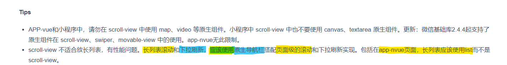
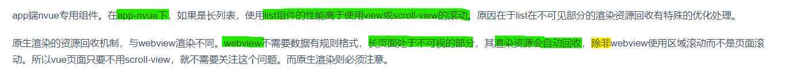
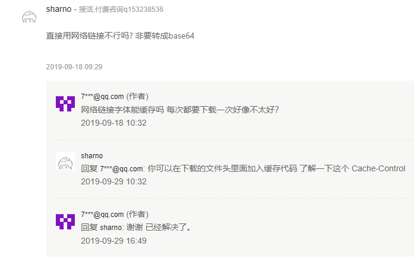
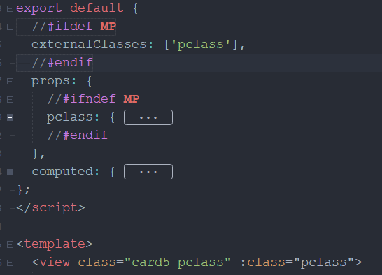

# NVUE

- `uni-app`框架仅对nvue页面嵌套`scroller`容器，不会给组件自动套`scroller`容器；
  
  > 若nvue页面有`recycle-list`组件时，`uni-app`框架也不会自动给页面嵌套`scroller`容器
  >
  > 若你不希望自动嵌套`scroller`容器，可在配置`pages.json`：
  
- nvue 页面的布局排列方向默认为竖排（`column`）

  > 改变布局方向 `manifest.json` -> `app-plus` -> `nvue` -> `flex-direction` 

- 750(weex > px;uni-app > rpx)

-  [subNVue (APP - vue 页面的原生子窗体) 原生子窗体开发指南](https://ask.dcloud.net.cn/article/35948)

  > 比 cover-view、plus.nativeObj.view 更强大的原生排版能力，方便自定义原生导航或**覆盖**原生地图、视频等;
  >
  > 也可以在 nvue 页面中使用。但目前在纯nvue下（render为native）还不支持。

# [预加载]

页面预载，[uni.preloadPage](https://uniapp.dcloud.io/api/preload-page)
[小程序分包(预)加载](https://uniapp.dcloud.io/collocation/pages?id=subpackages)

# 常见问题

## [**tabbar常见问题**](https://uniapp.dcloud.io/collocation/pages?id=tips-tabbar)

- 显/藏, 动态内容, 角标;

- tabbar 的 item 点击事件

- 切换选项卡

- tabbar 高度(默认:50px)

- 如果是需要先登录、后进入tab页面...

- PC宽屏适配多窗体结构

- #### [H5自定义tabbar](https://uniapp.dcloud.io/collocation/pages?id=custom-tab-bar)

<details>
  <summary>示例</summary>
   "tabBar": {
    "color": "#7A7E83",
    "selectedColor": "#3cc51f",
    "borderStyle": "black",
    "backgroundColor": "#ffffff",
    "list": [{
        "pagePath": "pages/component/index",
        "iconPath": "static/image/icon_component.png",
        "selectedIconPath": "static/image/icon_component_HL.png",
        "text": "组件"
    }, {
        "pagePath": "pages/API/index",
        "iconPath": "static/image/icon_API.png",
        "selectedIconPath": "static/image/icon_API_HL.png",
        "text": "接口"
    }]
}
</details>

## 导航栏开发指南

-  [导航栏开发指南](https://ask.dcloud.net.cn/article/34921)


- [自定义导航栏使用注意](https://uniapp.dcloud.io/collocation/pages?id=customnav)
- [自定义导航栏](https://ask.dcloud.net.cn/article/36388)

# 页面滚动 和 区域滚动





## 字体加载

```vue
<text class="icon">&#xe632;</text>
<text class="icon">\ue632</text>
//App.vue
<script>
    //或本地引入ttf文件即可
var icon_url = '//at.alicdn.com/t/font_2926603_2c1mkunibzl.ttf';
//#ifdef APP-PLUS
const dom = weex.requireModule('dom');
dom.addRule('fontFace', {
	fontFamily: 'iconfont',
	src: `url('https:${icon_url}')`
});
//#endif
</script>
<style>
    //仅vue
@font-face {
	font-family: 'iconfont';
	src: url('https://at.alicdn.com/t/font_2926603_2c1mkunibzl.ttf') format('truetype');
}
    //使用
.icon {
	font-family: iconfont;
}
</style>
```



# swiper

- 设置flex: 1;可撑满父元素

  > 前提父元素父元素具有固定大小 
  >
  > 可获取swiper大小信息赋予父元素再设置flex: 1;

# 组件样式隔离

[微信小程序](https://developers.weixin.qq.com/miniprogram/dev/framework/custom-component/wxml-wxss.html#%E7%BB%84%E4%BB%B6%E6%A0%B7%E5%BC%8F%E9%9A%94%E7%A6%BB)

```js
export default {
	options: {
        //组件内外互相影响
		styleIsolation: 'shared'
	}
};
```

# 外部样式类



```js
//#ifdef MP
externalClasses:['pclass'],
//#endif
//注意 !important
```

# 蓝牙

- 支持搜索BLE模式蓝牙( v4.0 | v4.0+ ), SPP模式蓝牙( v4.0- )需使用Native.js提供的方式

# ref

uni-app 中可以使用$refs，但是需要注意的是在小程序平台不能引用内置组件。
