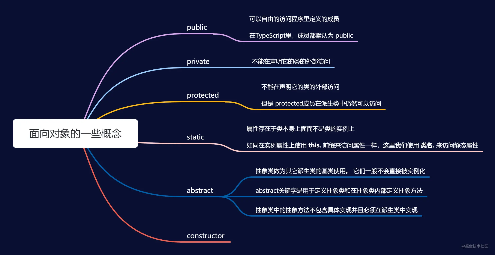

### [✨✨✨](https://tsejx.github.io/javascript-guidebook/core-modules)

### [ ES6 - ES13文章](https://juejin.cn/post/6968269593206849572#heading-10)

https://juejin.cn/post/6945640942976122910#heading-1

## let 和 const

***let***

- 存在作用域 - 块级{} / 全局 / 函数(局部)  / eval(严格模式下才有)

- 互不影响 var会跑去全局, let不会是单独的; 

  ```javascript
  for(var a = 0;i < 5){}//完毕后 全局a==5, for条件内局部 a==4
  for(let a = 0;i < 5){}//完毕后 全局没有对象a, for条件内局部 a==4
  //所以let a变量不可能等于5
  ```

- 不存在变量提升

  比如 : var 和 方法 之类的, 运行时就会提前声明(还未读行执行时, 就最先声明)

  ```javascript
  Console.log(a);//输出Undefined 变量提升了
  var a = 123;
  //////////////////////////
  Console.log(a);//未定义遍历a 报错
  let a = 123;
  ```

***const***

- 一定要初始赋值
- 一般命名大写
- 有作用域
- 初始后不能修改, **对常量内的数组或对象修改不会报错**

## 解构赋值

- 按照一定结构(比如同名)模式提取值和赋值

- ```javascript
  var { x , y ， ... z  }  =  {  x：1 ， y：2 ， a：3 ， b：4  } ; 
  x ;  // 1 
  y ;  // 2 
  z ;  // {a：3，b：4}
  
  var {a,b} = name;//从name里单独拿出两个对象使用;
  var [a,,c] = '12334';//1;3;
  /////////////////
  function a({0,2}){}//es5 j
  a({0:'a',1:'b',2:'c'})
  ```
  
  > 交换: `[[a], [b]] = [[b], [a]];`
  >
  > 从一个对象取其某属性

## 反引号``

- 内容中可以直接出现换行符，不需要 + 号连接；

  ```javascript
  `内容中可以直
  接出现换行符`
  ```

- 变量拼接 ${}   `123${我是变量}4567`

## ()=>{} 的特性(区别)

1. 箭头函数的**this指针是静态的**, 始终**指向创建时的上级作用域**

   

2. 不能实例化箭头函数的对象

3. 不能使用 arguments 变量

   - arguments 对象存储了实参

4. 简写 - 简洁

   - 省略小括号  -  形参只有一个的时候

   - 省略花括号  -  代码只有一条语句的时候; 


```javascript
const r = [1,3,6,7].filter(item => item % 2 === 0);//filter条件筛选
```

## rest 参数

- `function name(...rest)` -- 前面三个点后面任意名 『数组类型』

> rest 参数必须放至**最后一个位置**
> 用于获取函数的实参,用来代替 arguments『obj类型』
>
> **类似于解构赋值**  如果传入实参多于形参, 将赋值给在最后面的 ...rest
## `属性名表达式`

添加属性示例:	obj.[表达式] 
等待Promise改变状态: (await Promise).property

## `更好的创建 构造函数`

```js
const a = {
    //仅在一个对象内部可用
    im() {
        console.log(123);
    }
}
a.im()
//等同于:
//im:function() {}
//如果是Generator 函数，则要在前面加一个星号:
...
//* im() {}
...
```

## `assign浅拷贝 和 is`

*Object.assign()*

- **浅拷贝**
- **同名属性将覆盖**
- **如果该函数只有一个参数**，当参数为对象时，直接返回该对象；当参数不是对象时，会先将参数**转为对象**然后返回。
- (...obj) 等于 Object.assign({},obj)

```js
把其他对象的/*属性*/复制到target对象里.
Object.assign(target,object2,object3,...);   // 第一个参数是目标对象，后面的参数是源对象
```

*Object.is()*

- 严格比较

- 与（===）的区别 :

- is()看结果; === 看地址和结果

  ```js
  //一是+0不等于-0
  Object.is(+0,-0);  //false
  +0 === -0  //true
  //二是NaN等于本身
  Object.is(NaN,NaN); //true
  NaN === NaN  //false
  ```

## `扩展运算符『...obj』`[🔗](https://www.runoob.com/w3cnote/es6-object.html)

> 扩展运算符能将『数组』转换为逗号分隔的『参数序列』
>
> **对深层对象: 第一层是深拷贝(非引用), 嵌套的则是浅拷贝**

> ...也是 剩余运算符

## 数组 [🔗](https://www.runoob.com/w3cnote/es6-array.html)

部分api:

2. ###### Array.`from`(arrayLike[, mapFn[, thisArg]])

   > **mapFn** - 可选，map 函数，**用于对每个元素进行处理**

   ```js
   Array.from([1, 2, 3], (n) => n * 2); // [2, 4, 6]
   ```
   

## ✨ Map, Set, Ref

new Map([key,value],...) - 键值对绑定 [🔗](https://developer.mozilla.org/zh-CN/docs/Web/JavaScript/Reference/Global_Objects/Map#%E5%AE%9E%E4%BE%8B%E6%96%B9%E6%B3%95)

> WeakMap键是**弱引用类型** 键失效时将被回收(不可迭代)

new Set() 存储具有唯一性 [🔗](https://developer.mozilla.org/en-US/docs/Web/JavaScript/Reference/Global_Objects/Set)

>WeakSet 保存**弱引用**集合

WeakRef() - 保留对象的**弱引用** [🔗](https://developer.mozilla.org/zh-CN/docs/Web/JavaScript/Reference/Global_Objects/WeakRef)

> **弱引用**不会阻止对象被 GC 回收

`数组去重|并集|交集|差集|排序`

```js
/*数组去重*/new Set(Array);
/*并集*/[...Array, ...Array]
/*交集*/[...new Set([...new Set(arr1)].filter(x => new Set(arr2).has(x)))]
/*差集*/
let a = new Set(arr1);
let b = new Set(arr2);
new Set([...[...a].filter(x => !b.has(x)),...[...b].filter(x => !a.has(x))]);
//小 -> 大
<arr>.sort((a, b) => a-b);
```

# 字符串 [🔗](https://www.runoob.com/w3cnote/es6-string.html)

## Symbol([description])

[🔗](https://developer.mozilla.org/zh-CN/docs/Web/JavaScript/Reference/Global_Objects/Symbol)

- **symbol** 是一种基本数据类型。

- 值是独立的 **独一无二的**。 -  值不可见

- 不能于其他数据类型进行运算

  ```javascript
  Symbol() != Symbol();
  Symbol.for() === Symbol.for();
  ```

- `Symbol()`函数会返回**symbol**类型的值，

- `Symbol.for()` 类似单例模式，会在全局搜索被登记的 Symbol 中是否有该字符串参数作为名称的 Symbol 值，如果有即返回该 Symbol 值，若没有则**新建并返回一个以该字符串参数为名称的 Symbol 值**，并登记在全局环境中供搜索。

- 该类型具有**`静态属性`**和**`静态方法`**。
  它的静态属性会暴露几个内建的成员对象；它的静态方法会暴露全局的symbol注册，且类似于内建对象类，但作为构造函数来说它并不完整，
  因为它**不支持语法**："`new Symbol()`"。

```javascript
let game = {/*值不可见*/};
    //key
    let a = {
        up: Symbol(),
    }
    //添加属性 //如果game内值不可见 怕通过 gam.名字 会重名 //解决方法Symbol
    game[a.up] = () => console.log('key');
    //调用
    game[a.up]()
/* 分割 */
let game2 = {
    //添加中括号 成为 静态属性 //Symbol() - 动态方法
        [Symbol('F')]: function () {
            console.log('发言');
        },
    };
```

> [ ] - 属性名表达式

[Symbol内置值和方法](https://developer.mozilla.org/zh-CN/docs/Web/JavaScript/Reference/Global_Objects/Symbol)

## `迭代器( Iterator)`[🔗](https://www.bilibili.com/video/BV1uK411H7on?p=19)

------

`for...of` : for(变量 of  对象 ) - `执行就是在反复调用next方法`

```javascript
    let a =['孙悟空','猪八戒','沙和尚'] // 不仅仅数组 - 只要原型有Iterator属性都可以
    for (let b of a) {
        console.log(b);
    }//依次输出: 孙悟空 回车 猪八戒 回车 沙和尚
```

> **数组多少个 就 循环多少次  依次递进赋值**

> `for...in`  依次从0开始赋值下标

> 原型对象 Iterator方法

<details>
  <summary>什么是 迭代器( lterator)</summary>
    迭代器( lterator)是一种接口,为各种不同的数据结构提供统一的访问机制<br />
任何数据结构只要部署 Iterator接口,就可以完成遍历操作<br />
<br />
1)ES6创造了一种新的遍历命令for...of循环, Iterator接口主要供for...of消费<br />
2)原生具备 Iterator接口的数据(可用 for of遍历)<br />
a)Array<br />
b) Arguments<br />
c)Set<br />
d)Map<br />
e)String<br />
f) typedArray<br />
g)NodeList<br />
    <br />
</details>

<details>
  <summary>工作原理</summary>
a)创建一个指针对象,指向当前数据结构的起始位置<br />
b)第一次调用对象的next方法,脂针自动指向数据结构的第一个成员<br />
    <br />
c)接下来每次调用next方法,指针一直往后移动,直到指向最后一个成员<br />
    <br />
d)每调用next方法返回一个包含vaue和done属性的对象<br />
    <br />
    一个Iterator方法里有>> 对象-里有next方法-里有value和done属性 - 所以可自构建此方法 - 标题链接详细
</details>


# [Generator 生成器函数](https://www.bilibili.com/video/BV1uK411H7on?p=20)

`function * name() {yield}`

- 需要通过 .next() **`调用`** - 类似迭代器的执行方式
- `yield` - 类似于分隔符一块一块的; 执行跟for...of类似调用一次next方法执行一次 后 递进
- `yield*`  [示例](https://developer.mozilla.org/zh-CN/docs/Web/JavaScript/Reference/Statements/function*#yield*的示例)
- `next(实参)`  - next可以给yield传递参数 - 传递的参数将作为**`上一次`**调用next的yield的返回[结果](https://www.bilibili.com/video/BV1uK411H7on?p=21)

```javascript
    function * gen() {
        let al = yield
        console.log(al,'一');

        let al2 = yield
        console.log(al2,'二');
        
        let al3 = yield
        console.log(al3,'三');
    }

//下面两个 for 执行效果一样 //
    let a = gen();//不放外面相当于一直是第一次执行 - 因为重新被赋值
    for (let index = 0; index < 3; index++) {
        a.next('实参');//给yield传参
    }

    for(let v of gen('实参')){}//给函数传参
```

[详细](https://developer.mozilla.org/zh-CN/docs/Web/JavaScript/Reference/Statements/function*)

# 迭代

```js
array.keys()//返回可迭代键
array.entries()//返回可迭代键值对 [key,value]
```


# Promise

状态处理:

- then()
- catch()
- finally()

```js
new Promise((resolve, reject) => {
    reject(err);//出错调用
    resolve(data);//成功后调用
})
//异步then返回一个 Promise 对象,状态由回调函数结果决定
.then(
    (value) => {
        console.log(value);//resolve()
        //return
    },
    (reason) => {
        console.log(reason);//reject()
        //return
    }
)
.catch()
.finally()
```

## Promise 中有[四个主要的方法](https://link.juejin.cn/?target=https%3A%2F%2Fv8.dev%2Ffeatures%2Fpromise-combinators)。

- var arr = [fetch("https://v8.dev/").then(() => "home"), ...]

- Promise.allSettled(arr)

  > **等待所有实例都返回结果**

- Promise.all(arr)

  > **异步操作都成功后**，才返回 promise,返回值组成一个数组

- Promise.race(arr)

  > **返回第一个结束状态的Promise**

- Promise.any(arr)

  > **返回第一个成功状态的Promise**, 都失败则返回一个失败


# async

- 异步

- async 函数返回一个 Promise 对象，可以使用 then 方法添加回调函数。

- await针对所跟不同表达式的处理方式：

  > **等待异步进程改变状态**

```js
    function testAwait() {
        return new Promise((resolve) => {
            setTimeout(function () {
                console.log("testAwait");
                resolve();
            }, 3000);
        });
    }
    async function myAsync() {
        console.log('执行中...');
        await testAwait();//暂停代码在该行上,等待执行完成
        console.log('完成');
    }
    myAsync().then(...);
```

# 同步异步相互转换

```js
//异步同步化
async function Sync() {
	return await new Promise((resolve, reject) => {
		this.resolve = resolve;
		this.reject = reject;
		this(...arguments);
	}).finally(() => {
		delete this.resolve;
		delete this.reject;
	});
}
//使用
function func() {
	func.resolve();
}
Sync.call(func).then((v)=>{
	console.log(v)
})
//异步化
Promise.resolve().then(()=>{})
//
await Promise.all(index.map(async ({ name }) => {
    name = name.replace(reg, '');
    tags[name] = await col.countDocuments({ 'tag': { $eq: name } });
}))
```

# Class

- 类不会被提升
- 继承关键字: extends
- 静态关键字: static "包含 this时指向类"
- 静态成员仅存在于类本身上
- 私有字段: `#name`
- 实例化时调用constructor
- 访问父类 `Object.getPrototypeOf(<Child>) === Parent;`
- 父构造函数 `super()`:  [🔗](https://tsejx.github.io/javascript-guidebook/object-oriented-programming/class-definitions/class-extends#super)
  1. 函数仅能在构造函数中执行
  2. 作为**对象**时:
     - 在普通方法中，指向父类的原型对象
     - 在静态方法中，指向父类

**`类的继承 :`**

```js
//父 = 基类
    class Father {
        Name = this.constructor.name;
        constructor(v) {
            this.value = v;
            console.log('this',this);
        }
        aa() {console.log("aa");}
    }
//子 = 派生类
    class Son extends Father {//extends继承
        constructor(v) {
            super(v);// 类似 -> Father.call(this,v);
        }
        foo(){console.log('foo');}
    }
    var son = new Son('extends');//实例
    //ps:和js笔记 "构造函数的继承" 差不多
```

## `get和set`

```js
class xx{
    get foo(){};
    set foo(){};
}
//读取和修改分别执行
```

# Proxy代理

```js
var target = {a: 1}
var handler = {
    get(target, key) {
        console.log('get', target, key);
    },
    set(target, key, value) {
        console.log('set',target, key, value);
        target[key] = value;
    }
}
var x = new Proxy(target, handler)//目标对象, 处理者
x.a
x.a = 10
console.log(target.a);//10
```

# [Reflect](https://developer.mozilla.org/en-US/docs/Web/JavaScript/Reference/Global_Objects/Reflect)

- 反射机制指的是程序在运行时能够获取自身的信息
- 窥探对象的内部结构；换句话说这就是反射。

## [`静态方法`](https://es6.ruanyifeng.com/?search=of&x=12&y=11#docs/reflect):

`Reflect`对象一共有 13 个静态方法都是通过一个函数执行来操作的,
		下面这些方法的作用，大部分与`Object`对象的同名方法的作用都是相同的

- Reflect.apply(func, thisTarget, [args]) - `调用一个方法并且显式地指定 this`

  > 非常类似 `func.call(target);`  和  `func.apply(thisArg, [args])` 
  > 等同于`Func.prototype.apply.call(func, thisArg, args)` 
  >
  > `<func>.bind(thisArg)`  绑定指针且不调用

- Reflect.construct(fu, [args]) - `类似new了一个函数`

- Reflect.has(target, name) - `判断对象是否具有某属性(和in运算符一样)`

- ------

- Reflect.get(target, name, receiver) - `查找并返回target|receiver对象的name属性`

  > target - 对象;name - 键;receiver - 对象
  > 如果`name`属性部署了读取函数（get），则读取的函数里的`this`指向`receiver`。

- Reflect.set(target, name, value, receiver) - `设置target|receiver对象的name属性等于value`

  > 如果`name`属性部署了读取函数（set），则读取的函数里的`this`指向`receiver`。

- Reflect.deleteProperty(target, name) - `等同于delete obj[name]，用于删除对象的属性。`

  > 删除失败，被删除的属性依然存在，返回`false`。

- ------

- Reflect.defineProperty(target, propertyKey, {attributes}) - `为对象定义描述符属性`

  > 等同于`Object.defineProperty`
  >
  > attributes: 
  >
  > 1. **configurable**: true - 可配置
  > 2. **enumerable**: true - 可枚举
  > 3. **value**: undefined
  > 4. **writable**: true - 可写
  > 5. **get(){this}** - get代理
  > 6. **set(v){}** - set代理

- Reflect.getOwnPropertyDescriptor(target, propertyKey) - `获取对象的描述符属性`

- Reflect.ownKeys(target) - `对象的所有属性`

  > 基本等同于`Object.getOwnPropertyNames`与`Object.getOwnPropertySymbols`之和。

- ------

- Reflect.isExtensible(target) - `当前对象是否可扩展`


- Reflect.preventExtensions(target) - `对象变为不可扩展`

  > 类似成了常量 ;  返回布尔值 ;

- ------

- Reflect.getPrototypeOf(target) - `读取对象的__proto__属性`

  > `Reflect.getPrototypeOf`和`Object.getPrototypeOf`的一个区别是，如果参数不是对象，`Object.getPrototypeOf`会将这个参数转为对象，然后再运行，而`Reflect.getPrototypeOf`会报错。

- Reflect.setPrototypeOf(target, prototype) - `扩展对象` 

  > 用于设置目标对象的原型（prototype)
  >
  > 区别第一个参数不是对象时，`Object.setPrototypeOf`会返回第一个参数本身，而`Reflect.setPrototypeOf`会报错。
  >
  > 返回布尔值

# [模块化](https://www.typescriptlang.org/docs/handbook/esm-node.html)

- type="module" - 标签属性

- export

  ```js
  //分别;统一;默认; - 暴露
  export let v = 1;export {obj,...};export default {v:1,...}
  ```

- import

  ```js
  import * as obj from "./module.js";//通用方式
  //解构赋值方式//重名解决使用as关键字:Name as newName
  import {obj,...} from "./module.js";
  ```


# [Intl API](https://juejin.cn/post/6968269593206849572#heading-11)

- `Intl` 对象是 ECMAScript 国际化 API 的一个命名空间，它提供了精确的

  字符串对比、数字格式化，和日期时间格式化。

# [URL方法](https://developer.mozilla.org/zh-CN/docs/Web/API/URL/URL)

`URL()` 构造函数返回一个新创建的URL对象

- `new URL(url , base)`
  1. url 以 base 为基准
- `<url>`.searchParams.get('xxx');

# import.meta

当前模块信息

# ES7

- **Array.prototype.includes(value);** //判断是否含给定值, 返回布尔
- **arr.indexOf(value); **//返回下标//负1 == 没有//无法判断NaN;
- `2 ** 10` //幂运算符**//2的10次方

# ES8

## 返回对象的值为数组 -- `Object.values(obj);`

## 字符串补全长度 -- `padStart();padEnd()`

```js
"x".padStart(4, "ab"); // 'abax'
"x".padEnd(5, "ab"); // 'xabab'
```

## [对象自身描述](https://juejin.cn/post/6968280964673830942#heading-4) - `Object.getOwnPropertyDescriptors()`

## [静态](https://link.juejin.cn/?target=https%3A%2F%2Fdeveloper.mozilla.org%2Fzh-CN%2Fdocs%2FWeb%2FJavaScript%2FReference%2FGlobal_Objects%2FAtomics) - `Atomics`

# ES9

## Promise.prototype.finally

```js
//finally在promise结束(不管成功还是失败)时的回调。
.then(result => {···})
.catch(error => {···})
.finally(() => {···});
```

## 按顺序完成异步操作

```js
async function printFiles() {
  const files = ...

  for (const file of await files) {
    console.log(file);
  }
}
```

> ES6 为数组引入了扩展运算符的写法， 在 ES2018 中，为对象也引入了此写法

....省略

# ES10

## 数组降维

```
flatMap()//只能展开一层数组
arr.flat(Number)//支持多层
```

## 数组对象互转

```js
Object.fromEntries([
  ["foo", "bar"],
  ["baz", 42],
]);
// { foo: "bar", baz: 42 }
```

> `Object.fromEntries` 是与 `Object.entries()` 相反的方法，

## 消除前后空格

- `.trimStart()`消除字符串头部的空格，
- `.trimEnd()`消除尾部的空格。
- `.trim()`除头尾空格

## 创建对象描述

```js
// 创建 Symbol 的时候，可以添加一个描述。
const sym = Symbol("foo");
sym.description; // "foo"
```

## [Err处理语句](https://www.runoob.com/jsref/jsref-try-catch.html)

```js
try {
  console.log(a);//执行代码块
} catch (error) {
  console.log("报错了");
}finally {}
```

## 排序 sort()

```js
obj.sort(function(a, b){return a.groupId - b.groupId}),	   //数字顺序排序
obj.sort(),                                            	  //字母顺序排序
obj.sort(function(a, b){return 0.5 - Math.random()}),     //随机
obj.reverse()                                         	//反转
```

...省略

# ES11

## 动态加载模块`import(module)`

- 返回一个 Promise 对象; `await import()`

> `import()` 类似于 Node 的 `require` 方法，**区别主要是前者是异步加载，后者是同步加载**。

> 

## 获取不同环境下的全局this  `globalThis`

- globalThis

  > ```js
  > if (typeof globalThis.setTimeout !== "function") {
  > // 此环境中没有 setTimeout 方法！
  > }
  > ```
  > 详细内容参考[MDN-globalThis](https://link.juejin.cn/?target=https%3A%2F%2Fdeveloper.mozilla.org%2Fzh-CN%2Fdocs%2FWeb%2FJavaScript%2FReference%2FGlobal_Objects%2FglobalThis)
  
  > ```js
  > // 浏览器环境 // => Window {...}
  > console.log(globalThis); 
  > // node.js环境 // => Object [global] {...}
  > console.log(globalThis); 
  > // web worker环境 // => DedicatedWorkerGlobalScope{...}
  > console.log(globalThis); 
  > ```

## 操作符< ?? , ?. >

- `data1 ?? data2` - 空位合并操作符

  > data1 不为 null和undefined 时返回data2
  > 弥补 `逻辑或操作符(||)` 将 **空字符串**,**0**,**NaN**判断为假值的不足

- `?.` - 可选链操作符

  > 判断**右侧**对象是否属于**左侧**  (验证引用是否有效)

## BigInt

- 旧版本的 JS 标准无法计算大于`Number.MAX_SAFE_INTEGER`的值(**2^53**)
  - 这个时候就可以使用`BigInt`
    可以用在一个整数字面量后面加 `n` 的方式定义一个 `BigInt` ，如：`10n`，或者调用函数 `BigInt()`。

# ES12

## 字符替换 replaceAll

- `<String>.replaceAll(<String>, <String>);`
- `<String>.replace(/<String>/g, "<String>");` 

## 弱引用 [WeakRef](https://developer.mozilla.org/zh-CN/docs/Web/JavaScript/Reference/Global_Objects/WeakRef)

- 对对象的弱引用是指当该对象应该被GC回收时不会阻止GC的回收行为。

- 可以通过 `FinalizationRegistry` 类，在某个对象被垃圾回收之后，执行一些自定义方法

- [实现真正意义上的弱引用](https://www.infoq.cn/article/lksmb2tlgh1ehg0*bbyg)

  > 不建议使用

# ES13

## 顶层 await

```js
export { a: await import(),b: await fetch(url) }
```

> 等待**Promise**改变状态, 再导出
>
> 在按需加载的场景下， `Promise` 方式链式调用麻烦的问题

## Class 字段相关特性 [🔗](https://juejin.cn/post/6968113844086374431#heading-1)



### 私有属性/私有方法

- 我们将使用`# 符号表示类的私有变量`。这样就不需要使用闭包来隐藏不想暴露给外界的私有变量。
- 不能在Class外部访问

### static 字段

- 静态字段可以用来代替枚举，也可以用于私有字段。
- 只会在类加载的时候执行一次。
- static 是类变量(方法)，只有一份副本，被该类所有实例共享。
- 静态方法调用直接在类上进行，不能在类的实例上调用。
-   可以通过 static {} 进行初始化
