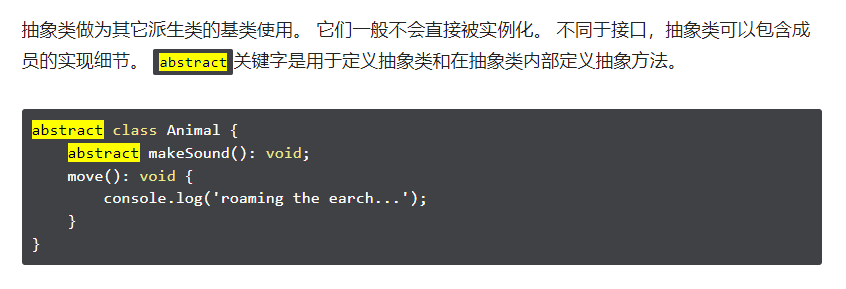

## cmd

- tsc --init
- tsc -w

## 部分关键字

##### `readonly` - 只读

- `-readonly`  移除对象只读属性

  `"-"` 代表移除列如 `-?`

- 类似: [Readonly`<T>`](#/Readonly) 和 obj as const

##### `override` - 覆盖

- `override` 方法必须具有与重写基方法相同的签名

## 类型操作

#### [ 泛型`<type>`](https://www.typescriptlang.org/docs/handbook/typescript-in-5-minutes.html#generics)

- 泛型(type)为类型(<xxx,...n>)提供变量(var)。

- 用于给变量提供类型

- 常见例子:

  ```ts
  type T = number | string;//类型别名(type)
  type StringArray = Array<string>;
  type NumberArray = Array<number>;
  type ObjectWithNameArray = Array<{ name: string }>;
  type t = { name: string };
  ```
  
  ```ts
  interface Backpack<Type> {
      add: (obj: Type):void;
      get: () => Type;
  }
  interface GenericIdentityFn {
      <Type>(arg: Type): Type;
  }
  ```
  
  [类型别名和接口的区别:](https://www.typescriptlang.org/docs/handbook/2/everyday-types.html#differences-between-type-aliases-and-interfaces)
  
  > interface扩展接口  !== Type扩展类型
  >
  > `interface`可通过 `extends` 继承其他interface (同名接口会合并)
  > `type`可通过 `<基泛型> & {code}` 继承其他泛型  -交叉类型(&)
  >
  > `implements`类似`extends`但是需要实现所有的属性和方法
  >
  > ```ts
  > interface A1{
  >  a:number;
  > }
  > type B = A1 | {b:string};
  > type C = A1 & {b:string};
  > // 与泛型组合
  > type D<T> = A1 | T[];
  > ```
  >
  > 省略...

## typeof - 获取对象类型

```typescript
class Foo {
  f(a: string): number {}
  fn(b: Parameters<typeof this.f>[0]) {
    const a: Parameters<typeof this.f>[0] = '';
  }
}
let h: Foo;
type d = Parameters<typeof h.f>[0];
```

## Keyof - 获取对象索引

```typescript
ype Point = keyof { x: number; y: number }; //  "x" | "y"
type Mapish  = keyof { [k: string]: unknown }; // string | number
```

## 映射类型

[可参考](#/Readonly)

- ```ts
  //in
  type OptionsFlags/*<Type>*/ = {
      readonly [Property in keyof { x: 0, y: 0 }]?: number;//索引键:属性类型
  }; // { readonly x?: number | undefined; readonly y?: number | undefined; }
  ```

> `obj1[keyof obj2]` **可遍历访问每一个子级的父级**

## 大小写转换

`Uncapitalize<StringType>` - 第一个字符转为小写
`Capitalize<StringType>` - 第一个字符转为大写
`Lowercase<StringType>` - 到小写
`Uppercase<StringType>`  - 到大写

## [工具类型](https://juejin.cn/post/6844903902563794952#heading-13)

定义类型属性

- `Readonly<T>` - **只读类型** <a id="/Readonly"></a>

  ```ts
  //lib.es5.d.ts内部Readonly的定义
  type Readonly<T> = {
      readonly [P in keyof T]: T[P];//每个键的值添加readonly标记
  };
  ```

- `Partial<T>` - **可选类型**

  ```ts
  type A1 = Partial<{a:number, b:string}> // { a?: number; b?: string;}
  ```
  
- `Required<T>` -  **必选类型** 与Partial相反(去除"?")

- `Pick<T,K>`, -  **保留已选的属性**, K代表要保留的属性键和值

- `Omit<T,K>` -  **排除已选的属性**

- `Record<K,T>` -  **键值类型限制**,K代表键类型 T代表值类型

  > `{ [key: type]: type; }` - 效果一样

- `Exclude<T,U>` - **类型求差**,去除T中与U相同的

- `Extract<T,U>` - **类型求并**,保留T与U相同的

- `NonNullable<T>` - **剔除T中的undefined和null**

- `ReturnType<T>` - **获取T的返回值类型**

- `InstanceType<T>` - 返回T的实例类型 **( T == 实列 )**

- `Parameters<T>` -  **获取函数入参类型**

- `ConstructorParameters<T>` **获取构造函数的入参类型**

  ```ts
  interface A{ new(a:number):string[]; }
  type A1 = ConstructorParameters<A> // [a:number]
  ```

- `<T> extends <U>?<X>:<Y>` - **条件类型** , U类型可以**表示**T, 那么返回X, 否则Y

- infer - **类型推断**, 配合条件类型使用

  ```ts
  interface T { (d:number):string }
  type a = T extends (...U: infer P) => string ? P : Function;//[d: number]
  ```
  
  

## 元组(Tuple)

表示一个已知**元素数量**和**类型**的**数组*** `let list1:[number, string]`

## [结构类型系统](https://www.typescriptlang.org/docs/handbook/typescript-in-5-minutes.html#structural-type-system)

- 两个对象具有相同的形状，则认为它们属于同一类型。
- 形状匹配只需要匹配对象字段的子集
- 接口(interface name{})

## 可选属性(?)

- `last?: string` - "?"向当前属性额外添加一个undefined项; C#里是额外null
- 非空断言运算符（后缀`!`）

```ts
function func (a: number, b?: number): number//表示选项b可有可无
```

## [类型断言(as)](https://www.typescriptlang.org/docs/handbook/2/everyday-types.html#type-assertions)

- 可指定更具体的类型:

  1. 如获取的页面元素

     ```ts
     document.getElementById("main_canvas") as HTMLCanvasElement;
     //等效于尖括号语法
     <HTMLCanvasElement>document.getElementById("main_canvas");
     ```
     
	2. 一般正常赋值会推理字面属性
	
	   ```ts
	   const method = "GET"//正常推理为string类型
	   const method = "GET" as "GET"//断言为GET类型
	   ```
	
	3. 或将整个对象转换 
	
	   ```ts
	   //属性全断言为常量 //普通js得定义对象描述属性
	   const S = {a:11,b:22} as const
	   ```
	
	4. 强制断言`const a = (expr as any) as T;`

## never 类型

- interface 不可 添加never 的类型
- never可添加给任何类型

> 通常从某类型查找时无此属性时可返回never类型
> 就是一个错误类型

## 函数重载(overload)

实参 没满足 形参个数时会报错所以需要重载

- 最后一个为具体实现

> C#函数重载每一个都可以有具体实现

## 类

关键字:

- `public`公开 `private`私有 `protected`保护 `abstract`抽象类 `readonly`只读 `static`静态

- 和private类似但`protected`在派生类中仍然可以访问

  

> 类 是一种类型所以 `接口可继承类`
>
> 类和接口同名时将`混合(mixin)`

```typescript
//类中这种简写方式将立即声明和初始化成员。
constructor(private str: string) {}
```

implements

`implements`类似`extends`但是需要实现所有的属性和方法

## namespace 命名空间

```typescript
//定义
namespace SomeNameSpaceName { 
   export interface ISomeInterfaceName {}  
   export class SomeClassName {}
}
//引用文件
/// <reference path = "SomeFileName.ts" />
//访问
SomeNameSpaceName.SomeClassName;
```

## 声明文件 `declare.d.ts`

- 通过`declare`声明的对象在任意文件和全局中具有类型

- ```ts
  declare namespace MyPlugin {
      export var n:number;
      export var f:(s:string)=>number;
  }
  ```

- [修改**已存在**的全局变量的**声明**](https://juejin.cn/post/6844903993727008776#heading-11)

  ```ts
  //用node下的global举例
  declare global {
      interface String {
          hump(input: string): string;
      }
  }
  // 注意: 修改"全局声明"必须在模块内部, 所以至少要有 export{}字样
  export {}
  ```

## [装饰器](https://juejin.cn/post/7006483808832716813#heading-6)

[🔗](https://www.typescriptlang.org/docs/handbook/decorators.html) , [🔗](https://jelly.jd.com/article/6163d8bac3f2f4019154ee94)

- [x] 代码输出目标版本小于`ES5` 时无法获取和返回描述符

- [x] 装饰器在**被**装饰的对象声明之前声明

- **装饰器工厂**(**利用柯里化解决装饰器传参问题**)

  ```typescript
  function lei(o: string) { return function (){} }
  ```
  
- **类 装饰器** `@xx class Person{}`

  - 运行时当作函数被调用，该类的**构造函数**作为其唯一的参数。

  ```typescript
  //返回构造函数时替换之前的声明
  function lei<T extends { new (...args: any[]): any }>(constructor: T) {
      return class extends constructor {}
  }
  ```

- **方法 装饰器** `@xx getName(){}`

  ```typescript
  function foo(target: any, key: string, descriptor: PropertyDescriptor) {
      //console.log(key, target === Lei.prototype ? "prototype" : "constructor");
      const T: any = target === Lei.prototype ? target : target.prototype;
      return {//修改描述符 并 添加额外逻辑
          value: async function (...args) {
              try{
                  await value.value.apply(this, args)
              }catch(e){
                  console.log(e)
              }
          }
      }
  }
  ```

  > 参数

  1. 装饰**实例**成员时为类的`原型对象`(prototype -> constructor ), 
     装饰**静态**成员时为类的`构造函数`(constructor -> prototype )
  2. 名称
  3. 属性描述符

  > 返回值 object

  1. 将用作该方法的*属性描述符*。

- **访问器 装饰器** `@xx get|set`

  - 应用于同名的(有静态区别) get和set

  > 参数和返回值同:`方法装饰器`

- **属性装饰器** `@xx name: string;`

  1. 静态成员的类的构造函数，或者实例成员的类的原型。
  2. 名称。

- **参数装饰器** `getName(@xx name: string)`

  1. 静态成员的类的构造函数，或者实例成员的类的原型。
  2. 名称。
  3. 函数参数的序号索引。
  
  > 只能用于在方法上声明的参数。
  
  

------

> 执行步骤:

参数 -> 方法 -> 访问器 -> 属性 -> 构造函数 -> 类

1. *参数装饰器*，后跟*方法*、*访问*器或*属性装饰器*应用于每个**实例**成员。
2. *参数装饰器*，后跟*方法*、*访问*器或*属性装饰器*应用于每个**静态**成员。
3. *参数装饰器*应用于构造函数。
4. *类装饰器*应用于类。

> 执行顺序

1. 正序执行func; 到序执行 return; 

------

## Reflect Metadata

- 实验性功能: [提案](https://rbuckton.github.io/reflect-metadata/)
- `npm i reflect-metadata --save`
- [API](https://github.com/rbuckton/reflect-metadata#api)
  1. 函数带有`Own`的是**对象和属性**,其他则是**对象和原型**

> 数据结构: `**WeakMap**<any, **Map**<any, **Map**<any, any>>>`
> 调用角度:weakMap.**get**(target).**get**(propertyKey下面的键).**get**(metadataKey)
>
> **类**的元数据undefined作为键。
> **静**态成员上以属性键为键。
> **实**例成员上prototype中以属性键为键。
>
> 元数据:一种对数据的额外描述


## tsconfig.json 常用

[全部配置](https://juejin.cn/post/7078666410339565576)

```json
"compilerOptions": {
    "target": "ES6",
    "module": "ESNext",
    
    //"baseUrl": "./", /* 相对路径时的根目录 */
    //"paths": { "@/*": ["./*" ] },/* 路径映射 //打包后映射的路径不会处理 */
    
    "outDir": "./outDir",/* 指定发出文件位置 */
    "declaration": true, /* 为发出的JavaScript文件生成 d.ts */
    "sourceMap": true, /* 为发出的JavaScript文件创建源映射文件 */
    //"inlineSourceMap": true, /* 在发出的JavaScript中包含源源映射文件。*/
    
    "noImplicitAny": true,  /*为隐含`任何`类型的表达式和声明启用错误报告  */
    "experimentalDecorators": true,//启用实验性的装饰器
    "emitDecoratorMetadata": true, //为源文件中的修饰声明的设计类型元数据
}
```

- `sourceMap` 有了它，出错的时候，除错工具将直接显示原始代码，而不是转换后的代码。

## 类型推断

- 推断值类型

```typescript
type Sidebar<T> = (arg: any) => T;
//function returnResultType<T>(arg: Sidebar<T>): T extends Promise<infer U> ? U : T
function returnResultType<T>(arg: Sidebar<T>): T {
  return {} as T;
}
const result = returnResultType((arg: any) => 3);
type ResultType = typeof result;
//or
type f = typeof func<string>;
type d = ReturnType<f>;
```

