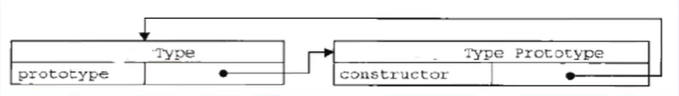
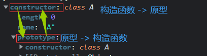

# HelloWorld

```javascript
alert("弹出警告框");
prompt("提示");
document.write("向body-页面，中输出一个内容");
console.log("向控制台输出一个日志文本");
<a href="javascript:alert(' HelloWorld');">
```
- 折叠`#region   #endregion`- - 始 / 终

# ✨标识符/变量/关键字

1. 标识符中可以含有字母,数字,_,$,但不能以数字开头。
    2.标识符不能是ES中的关键字或保留字
    

> let 声明的变量只在 let 命令所在的代码块内有效。
> const 声明一个只读的常量，一旦声明，常量的值就不能改变。
>
> 每个变量都对应着一小块内存,变量名用来查找对应的内存,变量值就是内存中保存的数据
> ✨`变量名 => 内存地址 => 数据`  -  `栈`(全局/局部变量(空间较小))`堆`(对象属性(空间较大))
>
> 内存：存储数据的空间
> 变量：指向内存的标识
>
> ✨声明的变量：**属性如果是 基本数据类型 - 那保存的就是这个数据；**
> ✨声明的变量： **属性如果是 对象 - 那保存的就是内存地址**

# ✨对象

- 对象：属性和方法组成

- ✨访问和添加属性

  > 1.通过点『`.属性`』的方式访问属性		   - 有特殊字符不可用 - 
  > 2.通过 中括号『 `[ '属性名']` 』				- 通用

#   **类型**

## 基本数据类型 : 保存的是基本数据类型的数据

####   **String			字符串**

> 使用单,双引号	\转义
>

####   Number		数值

> float-单精度
> double-双精度
>
> NaN (number类型,假或空）通过函数	`isNaN(被判断的)`	**判断是否属于NaN**
>
> MIN最大，MIN最小，Infinty正无穷

####   Boolean		布尔值

> true-真
> false-假

####   ✨Null				空值

> 空对象 (初始赋值为null,表明将要赋值为对象)
> **✨赋值为null等于指向对象为垃圾对象,将会更早释放 (GC垃圾内存回收),** 

####   Undefined	未定义

> 未定义（声明对象但未赋值时，他的值就是Undefined）


##  引用数据类型

<details>
  <summary>✨一个变量名**引用(指向/保存)**一个内存地址值</summary>
<br />
    保存的是地址值;ps - 引用类型 等同于 对象类型
</details>


####   Object	对象（引用类型数据类型）**NEW**
> `宿主对象：`JS运行环境提供
>
> - ```
>   Array()-数组	Object()	
>   ```
>
> Bom-浏览器对象模型-如console.log();	document.write();
> Dom-文件对象模型
>
> `自定义对象：`对象内值称为属性值。**属性值可以是任何数据**
- ```javascript
  --构造函数：使用new关键字调用的函数，是构造函数constructor
  var obj = new Object();//构造-函数-();
  --对象.属性名  =  属性值;
  obj.name = "0216";
  obj.age = "132";
  console.log(obj);
  --运行结果--
  Object {name="0216", age"132"}
  --读取：语法：对象.属性名-obj.name
  --删除对象delete 对象.属性名
  ```

> 对象是保存到堆内存中的,每创建一个新的对象,就会在堆内存中开辟出一个新的空间
> **而变量保存的是对象的内存地址(对象的引用)**

- ```javascript
  也可以 var obj = {};	//可以-{属性名: 属性值,属性名: 属性值,...属性名: {...}...}
  		obj.name="16";
  效果等同于NEW的Object函数
  ```

#### function

#### Array

## [替换字符串:](https://www.w3school.com.cn/jsref/jsref_replace.asp)

`变量.replace(/被替换/, "替换")` 	""第一个。//全局。

```
document.write(str.replace(/Microsoft/, "W3School"))
```

------

## 判断 数据类型：

##### **`✨语法：typeof 对象`**

> **可以判断** - 字符串 / 数值 / 布尔值 / Undefined / function
> **不能判断** - null  与 Object  ,  Object 和Array
> `Object.prototype.toString.call(obj).slice(8, -1).toLowerCase()` - 不能判断`NaN`

```javascript
//运算符typeof
var a = 123;
var b = typeof a;//检查后的赋值给对象
//一样
console.log(typeof	变量)
/////////////////////////////////
var a;
console.log(typeof a==='undefined') 返回true; - 注意单引号
```
检查 字符串string 	时返回	'string'
检查 数值number	 时返回 	'number'		
检查 布尔值boolean 时返回	 'boolean'
检查 Undefined		时返回	 'Undefined'

✨检查 **Null** 					时返回	 **'object'**

通过函数	`isNaN(被判断的)`	**判断是否属于NaN**
is-是不是

##### `检查实例 instanceof`

​					`变量a instanceof 变量b` 或 `变量a instanceof Object `
​						**根据类型创建的对象叫实例对象  如 `a = new b()`**

> 语法:  被检对象实例  instanceof 是否属于这个对象实例 ;类似检查子是否属于这个父.
> 所有的对象都属于object的子.

##### `完全等于 ===`

Undefined / null - **可以检查**

------

## 转换	数据类型：

**`语法1：变量.toString(16表示转换为十六进制);	只有toString`** 
**`语法2：类型(被转变量);	方法通用`**

- **`语法3：parseInt();parse-解析 Int-整型。`		提取-整数-后再转换为number**
  **`语法4：parseFloat();Float-单精度`					 和语法3区别在于可以转换小数**

> **不会影响原变量，但是你可以把原变量替换。变量等于null和undefined时转换没意义**
>
> 转换成 **数值型** 时有非法字符将整条直接转换成NaN。
>
> true真 **转换**为 1     false假 **转换**为 0     null **转换**为0     undefined**转换**为 NaN
>
> **数字 ** ---> **布尔** 。 `除了0和null 其他都是 true真`
> **字符**  ---> **布尔** 。 `除了空串空格 其他都是 true真`

```javascript
var a = 123;
//转换 语法1	//to只有字符串
var b = a.toString();//调用a的toString()方法
//转换 语法2	//通用
a = String(a);
//控制台输出
console.log(typeof b);
console.log(b);
```

> 🎁 parseInt('245px', 10);("对象",进制) - 转10进制**去除字符**

<details>
  <summary>属于包装类(String();number();boolean();)</summary>
    <br />
    可以将`基本数据类型`转换为`对象`<br />
方法和属性之能添加给对象,不能添加给基本数据类型。<br />
`当我们对一些基本数据类型的值去调用属性和方法时`<br />
`浏览器会临时使用包装类将其转换为对象,然后再调用对象的属性和方法`<br />
</details>

# 进制更改（默认十进制）

**十六进制**	以	**0x**	开头。**八进制**	以	**0**	开头。**二进制**	以	**0b**	开头。`其他浏览器可能不支持,或强制转换也各有差异`

```javascript
//更改进制
a = 0x123
//强制转换	//(变量，转换什么进制)
parseInt(a, 8);
String(a, 8);
//十六进制
toString('hex');
```

# *运算符	部分

## ✨位运算符[🔗](https://www.w3school.com.cn/js/js_bitwise.asp)

| &    | AND          | 如果两位都是 1 则设置每位为 1                            |
| ---- | ------------ | -------------------------------------------------------- |
| \|   | OR           | 如果两位之一为 1 则设置每位为 1                          |
| ^    | XOR          | 根据右边的1进行取反                                      |
| ~    | NOT          | 反转所有位(反转)                                         |
| <<   | 左位移       | 通过从右推入零向左位移，并使最左边的位脱落。             |
| >>   | 右位移       | 通过从左推入最左位的拷贝来向右位移，并使最右边的位脱落。 |
| >>>  | 零填充右位移 | 通过从左推入零来向右位移，并使最右边的位脱落。           |

```javascript
// ^ //两数合并同类(1)翻转
 6 = 0110
 2 = 0010
---------------------------------------------
XOR = 0100
二进制代码 0100 等于 4 十进制
//利用这个特性就可以加解密
28724^88757 = 76417
76417^88757 = 28724
```

[**特别注意：各运算符优先级**](https://blog.csdn.net/polarisyj86/article/details/82226796)

## 对于&&的非布尔值
`var = 前布尔&&后布尔`	**返回原值**

**&&**	两个值		**都为true**	 	则 **返回	后	边的**
**&&**	两个值		**都为false**		则 **返回	前	边的**
**&&**	其中 		**一个为false一个为true** 	  则 **返回	false里的值**

## 或运算符

**||**		如果**第一个值为	false**，则**直接返回 第二个值**
**||**		如果**第一个值为	true**，则**返回 第一个值**

## 赋值	=		

```
var a = a + 5	和	var a+ = 5	是一样的
a* = 5,a- = 5,	....
```
## *关系运算符	>,<,+,==,===,!==

**===**	**完全等**，不做类型转换，**类型不相同** 直接返回 **false**
**!==**	**不完全相等,**	不做类型转换，**类型不相同** 直接返回 **true**
`var a = 3 > 5	判断关系`
关系 **成立** 返回 **true**  ，**不成立**返回 **false**

**任何值**和**NaN(非数值)**作比较都返回**false**

两边**都是字符串**则转换成**Unicode编码**进行比较，
一位一位进行比较，一位一样则进行下一位比较。
注意：转码

## [Unicode编码 转换和输出](http://tool.chinaz.com/tools/unicode.aspx)

在**字符串中**使用转义字符**输出Unicode编码**
`conlose.log("\u四位编码")-她-\u5979或各种符号-☺-\u263a`
**网页中**使用**Unicode编码 = 十六进制**，**转换成十进制输出**
`conlose.log(&#四位编码)-四位编码先转十进制`

## *条件运算符（三元?:）

`条件表达式?语句1:语句2;`条件**成立执行语句1**,**不成立执行语句2**

还可以：

```javascript
var a = c > b?c:b;//被执行语句赋值给a
var a = c > b?([m>a?3+1:4+2,m>a?3+1:4+2]):(m<a?44*3:m+6);//套娃
```


## in	运算符

**检查一个对象中是否含有指定的属性**
如果有则返回**true**,没有则返回**fa1se**
**语法**:`"属性名" in 对象`

# 代码块{}
> **要么不执行，执行其中一个将全部执行**

# 语句	If		else		For		Switch		While	Do-while	Break	Continue	Return

`if(条件){执行}else if(条件){执行}else{执行}可嵌套`	如果，否则1，否则2

`for(var a=3;a>9;a++){执行}可嵌套`	可以只写条件，其他两个可放其他地方,(;;)

[【索引问题】一个关于for的细节](https://www.bilibili.com/video/BV1YW411T7GX?p=106)

```javascript
switch	('1'){
    case '1':{};break;
    case '2':{};break;
    default:{};break;//无符合执行
}
```

`while(条件){执行}`条件不再成立时结束循环(while循环 先判断再执行,**无分号**)
`do{执行}while(条件);`(do-while循环 先执行再判断,**有分号**)

`break    适当位置退出整个循环`
`continue 跳过当次循环执行下次循环`
`return 填要返回的值`  `退出当前函数，并从那个函数返回一个值至原对象`

# 计时器

console.time("计时器名字")//`开启`一个计时器
console.timeEnd("计时器名字")//`关闭`一个计时器

# [定时器](https://www.runoob.com/jsref/met-win-setinterval.html)

```javascript
setInterval()
clearInterval()

setTimeout()
clearTimeout()
```

# 监听

下面是两个函数f1和f2，编程的意图是f2必须等到f1执行完成，才能执行。首先，为f1绑定一个事件（这里采用的jQuery的写法）

```
f1.on('done', f2);
复制代码
```

上面这行代码的意思是，当f1发生done事件，就执行f2。然后，对f1进行改写：

```
function f1() {
  setTimeout(function () {
    // ...
    f1.trigger('done');
  }, 1000);
}
```

window.addEventListener('beforeunload', fu) - **监听浏览器刷新之前**
window.removeEventListener('beforeunload', fu) - **取消监听这个事件**

# 函数

## ✨[Function 对象(){}](https://developer.mozilla.org/zh-CN/docs/Web/JavaScript/Reference/Global_Objects/Function)

[**可以将要封装的代码以字符串的形式传递给构造函数**](https://www.bilibili.com/video/BV1YW411T7GX?p=52)

通过typeof  **检查函数对象**  时会返回Function。

> ✨如果被传的对象属性是基本数据类型，就给函数传递的是基本数据；
> ✨如果被传的对象属性是 对象时，就给函数传递的是 内存地址；
>
> 静态成员属于函数而不是属于实例;(静态成员-直接给函数添加的属性)


```javascript
//	封装：
var fun = new Function(" conso1e.1og("He11。这是我的第一个函数)");// 括号内的 存入fun对象里
//	封装方法2：（更简便）
Function fun(){参数}; /*或*/ var fun = Function fun(){参数};
//	添加：
fun.name = "02";
//	调用：
fun();//对象();
```
```javascript
//括号(形参a，形参b，形参c,...)内相当于 var 对象=;var 对象=;var 对象=;
Function sum(a,b,c){
    console.log(a+b)
    console.log(a+c)
};

//	调用：//(实参)
sum(134,257,356)//传入(无对应 实参时 值为Undefined)
```
**IIEF立即执行函数(匿名)**:

```javascript
(Function (形参){被执行})(实参) <--匿名函数(无对象). 注意加两个小括号
```

## arguments

arguments是function 对象(){}原型里的
实参传递过程: 调用-对象.(实参) --> 封装入arguments --> function 对象(形参) --> 
就像是依次装入数组那样,所以arguments可以跟数组一样调用索引arguments[0],当然也可以计算数组长度
他里面还有一个属性callee -里面对应一个函数,就是当前的(function 对象(形参){参数}) | arguments.callee

## [返回函数: return](https://blog.csdn.net/jnshu_it/article/details/77915624)

`语法: return 填要返回的值`	return **退出当前函数，并从那个函数返回一个值至原对象。**

```javascript
function n(a,b,c,d){
    var k=a+b+c+d; var j=c/d+b;
    return k+j;/*返回k+j后的值至 原对象,并跳出*/
};
var k = n(45,7,8,98)//k = n
console.log(k)
```
```javascript
		function n(o){		// <-如上代码块如果函数n,存入(n)《 function n(n){ 》
			var k=o.a+o.b; var j=k+o.a;
			return k+j;
		};
		//通过对象传参数(当参数过多时通过对象封装)
		var o={a:45,b:5}//可防止混淆
		var k = n(o) // 实参可以是任意 当然也可以是函数（注意区别）
			console.log(k)
```

- [x] **n()-调用函数-返回值；n-函数对象;	<--区别**

- `求偶: return 对象 % 2 == 0;`	对象 取模2 后再判断是否等于0;返回值为**true**或**false**
  
  - 半径R求圆面积 (3.14乘R乘R)	
  

## [创建函数](https://www.bilibili.com/video/BV1YW411T7GX?p=64)
创建一个构造函数,专门用来创建 Person对象的
`构造函数就是一个普通的函数,创建方式和普通函数没有区别`
不同的是构造函数**习惯上**首字母大写
构造函数和普通函数的区别就是调用方式的不同
`普通函数是直接调用,而构造函数需要使用new关键字来调用`

```javascript
//创建新的 | 库原有的如Object...
functio Nnn (){}//将新建的对象设置为函数中的this//{this} = n//在构造函数中可以用this来引用新建的对象
var n = new Nnn();//调用//注意()可传参数
//详细NEW参考笔记
```
### 检查实例 instanceof

> 语法:  被检对象  instanceof 是否属于这个对象 ;类似检查子是否属于这个父.
> 所有的对象都属于object的子.

### 构造函数修改

可以使`局部构造函数`**里的对象属性等于**`全局的构造函数`

> **`问题`**	
> 	创建一个 Person构造函数
> 	在 Person构造函数中,为每一个对象都添加了一个 sayRam方法
> 	目前我们的方法是在构造函数内部创建的
> 	也就是构造函数每执行一次就会创建一个新的 sayName方法
> 	也是所有实例的 sayName都是唯一独立的
> 	这样就导致了构造函数执行一次就会创建一个新的方法
> 	执行1999次就会创建1999个新的方法,而1999个方法都是一摸一样的
> 	这是完全没有必要,完全可以使所有的对象**共享同一个方法**

**`解决方法`**：定义在全局作用域中 去调用

> 利: 可以优化性能节约空间.
> 弊: 占用了全局作用域命名空间. 如多人制作同项目时他不知道你定义的这个名字.
> 解决方法: 原型对象.

## ✨原型对象

- 函数的prototype默认指向一个空对象(即:原型对象)
  
- 原型对象属性 constructor指向函数对象
  
- `<object>.hasOwnProperty(<Attr>)` 检查对象自身中是否包含该属性
  
- `prototype`-显式原型; `__proto__`-隐式原型(存在于实例, 值为prototype的值)
  
  > Type=函数名
  
  
  
- constructor和 prototype **相互包含**
  
  > 

<details>
  <summary><a href='https://www.bilibili.com/video/BV1YW411T7GX?p=68'>toString()-[ object object] :</a></summary>
 当我们**直接**在页面中**打印一个对象时**,`实际上是输出的对象的 tostring()方法的返回值`<br />
如果我们希望在输出对象时不输出[ object object],可以为对象添加一个 tostring()<br />
`可以找到toString()的位置进行修改,在原型对象里的话修改将应用于全部该原型的分对象`<br />
</details>
## 构造函数的继承


```javascript
    //构造函数的继承
    function Father(Name, Value) {
        this.Name = Name;
        this.Value = Value;
        console.log('this', this);
    }
    Father.prototype.aa = function () {
        console.log('aa');
    }

    function Son(n, v) {
        Father.call(this, n, v);//使用call方法;使Son调用Father
    }

    var son = new Son('十一', 'dog');
    
    son.prototype = new Father();//son的原型 = Father实例 // 核心
    son.prototype.constructor = son;//矫正一下
    son.prototype.aa();//因为son继承了Father
```

[**继承函数 :**](https://www.bilibili.com/video/BV1YW411T7GX?p=79)

默认情况下函数里的this继承的是全局window对象
在调用call()或apply()时可以将一个对象指定为调用时的第一个参数
	-`此时这个对象将会成为函数执行时的this`
	-call方法,实参将会在对象之后依次传递` (a,b) | 对象.call(对象,a,b)`
	-apply方法,实参需要封装到一个数组传递` (a,b) | 对象.call(对象,[a,b])`

```javascript
function a(){console.log(this)};
//此时调用将会打印[object window]
function fun(){console.log(this.name)};
var obj ={name:objjj}
fun.call(obj)//打印了obj里的name值
```

# ✨垃圾回收 (GC)

当你**new了一个对象**(`开辟了一个堆内存空间`),
		之后**值**设置为了**null**(`断开了指向该内存的引用`-就没对象或属性用这个内存了)---称为垃圾

> JS中有自己的垃圾回收机制--回收无引用的内存
> `如果该对象还是引用该内存,但该对象无需使用了--只需要设置为null即可,将断开内存引用`
>
> - ✨释放内存：
>   		局部变量：函数执行完自动释放
>     		对象：成为垃圾对象  => 垃圾回收器回收

<details>
  <summary>✨JS引如何管理内存?</summary>
    <br />
1.内存生命周期<br />
    1).分配需要的内存<br />
    2.使用分配到的内存<br />
    3).不需要时将其释放/归还<br />
2.释放内存<br />
    为执行函数分配的栈空间内存:函数执行完自动释放<br />
    存储对象的堆空间内存:当内存没有引用指向时,对象成为垃圾对象垃圾回收器后面就会回收释
    放此内存
</details>
#  in & of

- in
  
  > 依次取**键值**
  > `if("key" in obj){console.log(存在key属性);}`
- of [🔗](https://developer.mozilla.org/zh-CN/docs/orphaned/Web/JavaScript/Reference/Statements/for...of)
  
  > 依次取 **属性** 
  >

# [数组](https://juejin.cn/post/6844903616218660872)

```javascript
//Array(个数)数组
var arr = new Array(),arr = [2,5,6];//都可以创建一个数组
arr[]=5;
//length 获取或修改长度-`对非连续的会取最大长度`
arr.length=2
//[获取的长度]
arr[arr.length]=
```
- 对象.**join**("连接符") -**连接符**比如**数组中间**隔开的**逗号**-连接符对合并的数组进行分隔

> [ ]数组-内啥都可以放--比如:构造函数的调用...
> { }对象

筛选并返回符合条件 : [filter((此方法会传值在这里)=>{return})](https://www.runoob.com/jsref/jsref-filter.html)  

------

在底层字符串是以数组形式保存的

```javascript
var arr = "ieoj  fjfu";
console.log(arr[0])//打印了一个i 
//.charAt(0)根据索引获取指定字符
//.charCodeAt(0)获取索引字符串的unicode编码
```


# 回调函数（callback）

- 什么是回调函数

  > 由我们创建,但不由我们调用 称为回调函数  - 由浏览器调用>IE8
  >
  > `触发某个事件后的调用`

**例如：forEach()**方法需要一个函数作为参数
	-`数组中有几个元素就会执行几次`
	-浏览器会在回调函数中传递**三个**参数

1. 当前正在遍历的元素 value
2. 当前正在遍历的元素的索引 index
3. 就是正在遍历的数组 obj

```javascript
forEach - 执行次数等于属性个数
var cc = [1,2,3,4,5];
	cc.forEach(
        function(value,index,obj){//每次执行,数组元素依次传入至第一个实参
            console.log(index + "hello+" + value);
            console.log(obj);
        }//可以使用 跳过当次循环 达成不连续执行
    );
//结果-打印了五个index hello value 和obj
```

# [作用域--全局-局部](https://www.bilibili.com/video/BV1YW411T7GX?p=58)

### **全局作用域--window :**`打开页面时创建--关闭时销毁`

直接编写在 script 标签中的代码,都在全局作用域中.
创建的 对象 都属于 window 的属性值.页面的任意部分都可以访问到

> **函数声明**.会被提前创建.`如函数Function name(){}`
> **函数表达式**.不会被提前创建.;`如var name = 函数`
>
> 全局变量等于 **window的属性**

### **✨局部-函数作用域:**`调用时创建--执行完毕销毁`

里面(局部)可以访问外面(全局)--外面不能访问里面
如果局部里套局部 反复...	//数据是从**里向外**一层一层**读**的（注意: 原型）

> **不使用var 声明的变量 都属于 局部变量** `a = 1;全局`

> ✨可以在局部变量里通过**`window.对象`**声明或调用一个全局对象再进行赋值**把局部变量暴露出去** 
>
> - 比如匿名函数可以使用

## 作用域链

> 当函数需要访问自由变量时，会顺着作用域链来查找数据。子对象会一级一级的向上查找父对象的变量，父对象的变量对子对象是可见的，反之不成立。

<details>
  <summary>详细一点</summary>
    作用域链是一个对象列表，用以检索上下文代码中出现的标识符。<br>
    标识符可以理解为变量名称，参数，函数声明。<br><br>
    函数在定义的时候会把父级的变量对象AO/VO的集合保存在内部属性[[scope]]中，该集合称为作用域链。<br>
自由变量指的是不在函数内部声明的变量。<br>
当函数需要访问自由变量时，会顺着作用域链来查找数据。子对象会一级一级的向上查找父对象的变量，父对象的变量对子对象是可见的，反之不成立。<br>
作用域链就是在所有内部环境中查找变量的链式表。<br>
      </details>


# [this](https://www.bilibili.com/video/BV1YW411T7GX?p=62)

**1.以函数的形式调用时,this永远都是 window--全局** `对象()`  - 因为是动态 - 指向上一层
**2.以方法的形式调用时,谁调用这个方法 this就是调用方法的那个对象** `对象.方法()` - 指向上一层
**3.构造函数调用时,this就是new后赋值的那个对象**
**4.以call或apply方法调用时,this就是指定的那个对象**	`对象.call(对象)`

var self = this 这样的代码，为了将外部 this 传递到回调函数中

```javascript
var name = "全局";

function fun(){//function函数
    console.log(this.name);//由内而外查找
}

var obj = {//方法
    name:"属性",
    sayName:fun	//由内而外查找
};

obj.sayName()//调用
```

> 如果指向内层的this 想指向外层 可以在外层定义一个变量赋值为this;

# Date 时间

`var d = new Date("月/日/年 时:分:秒")`
`Date.now();获取当前时间戳`

`getTime()`

> **获取当前日期对象的时间戳**
> 时间戳,指的是从 **格林威治标准时间** 的1978年1月1日,θ时θ分0秒
> 到当前日期所花费的毫秒数(1秒=1000毫秒)
> 计算机底层时间使用的都是时间戳

[W3](https://www.w3school.com.cn/js/js_date_methods.asp)
[更多方法菜鸟教程](https://www.runoob.com/jsref/jsref-obj-date.html)

# Math 数学

**Math 对象并不是和其他对象一样是个函数---他是一个工具类.**

```
Math.ceil(Math.random()*10);     // 获取从 1 到 10 的随机整数，取 0 的概率极小。

Math.round(Math.random());       // 可均衡获取 0 到 1 的随机整数。

Math.floor(Math.random()*10);    // 可均衡获取 0 到 9 的随机整数。

Math.round(Math.random()*10);    // 基本均衡获取 0 到 10 的随机整数，其中获取最小值 0 和最大值 10 的几率少一半。
```

[哔哩哔哩](https://www.bilibili.com/video/BV1YW411T7GX?p=82)
[更多方法菜鸟教程](https://www.runoob.com/w3cnote/js-random.html)

# 执行条件

https://blog.csdn.net/weixin_46370867/article/details/109757295

	//页面加载完毕后立刻执行
	window.onload = function () {}
	//滚动时执行
	window.onscroll = function () {}

> 条件 = 构造函数


# void

void()<!-- 仅仅是代表不返回任何值，但是括号内的表达式还是要运行 -->
`<a href="javascript:void(alert('Warning!!!'))">点我!</a>`

# call()

- 被调对象.call(调用对象,实参)

```javascript
    var a = {name:'孙悟空',age:'18'};
    function qw() {
        console.log(`'名字:'${this.name},年龄:${this.age}`);
    }
    qw.call(a);//  通过a变量调用了qw函数   //所以this指向了a
```

[call()、apply()、bind()](https://www.runoob.com/w3cnote/js-call-apply-bind.html) 