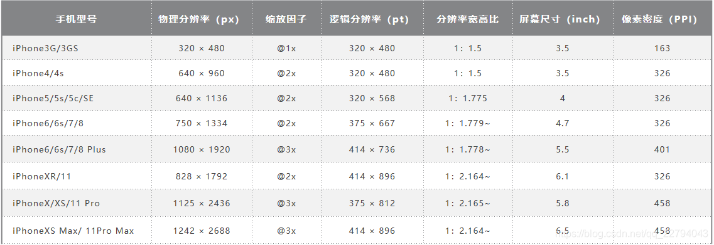

## 贝塞尔曲线算法

> https://segmentfault.com/a/1190000018597975


`点到点的过程为 t = 起点 / 目标 * 100`

1. a和b点连成线段ab，点o沿ab起点至终点（一阶）
2. c和d点 成线段cd，d和e点 成线段de。点a沿cd起点至终点，点b沿de起点至终点（二阶）
3. n阶...; 就是一堆 点到点点到点点到点 的相同耗时的运动过程

> 搭配`requestAnimationFrame`方法食用更佳

## 标签属性

[inert “惰性”](https://mp.weixin.qq.com/s/mGUF7ZHbPV11fCDmuzO5Fw)

- `<Element inert />`**用户对该节点的任何操作**表现为好像该节点不存(如: 页面查找,点击,焦点, 输入,文字选中,...)
- `title` - 鼠标悬浮提示

## 节点

```js
//常用
document.querySelectorAll("css选择器");
document.querySelector("css选择器");
el.style.setProperty('被更改的css变量', '更改属性值');//修改css属性
el.setAttribute("Attr","value");//修改标签属性
el.getAttribute("Attr","value");//获取标签属性
el.getRootNode({composed:false}) //返回上下文中(或组件)的根节点
el.(parentNode || parentElement) // 获取元素父节点
el.insertBefore(newChild,Child);//在Child前面添加新节点
el.appendChild()//末尾添加新的子节点
el.cloneNode(true)	//克隆元素
document.importNode(node, true); //拷贝元素
document.createElement() //创建元素
document.documentElement
document.body
el.content //内容
```

## 标签

### [✨自定义组件](https://developer.mozilla.org/zh-CN/docs/Web/Web_Components#%E6%95%99%E7%A8%8B)


#### [注册](https://developer.mozilla.org/zh-CN/docs/Web/API/CustomElementRegistry/define)

- 自定义元素
- 自定义内置元素(类似vue自定义指令)

`customElements.define('name-a', constructor, options);`

```js
class ExpandingList extends HTMLElement {
    constructor() { super() }
}
//自定义内置元素
customElements.define('expanding-list', ExpandingList, { extends: "ul" });
<ul is="expanding-list" />
//自定义元素
customElements.define('expanding-list', ExpandingList);
<expanding-list />
```

#### [生命周期](https://developer.mozilla.org/zh-CN/docs/Web/Web_Components/Using_custom_elements#%E4%BD%BF%E7%94%A8%E7%94%9F%E5%91%BD%E5%91%A8%E6%9C%9F%E5%9B%9E%E8%B0%83%E5%87%BD%E6%95%B0)

```js
class ExpandingList extends HTMLElement {
    constructor() { super() }//创建时
    connectedCallback(){}//首次被插入文档 DOM 时
    disconnectedCallback(){}//文档从 DOM 中删除时
    adoptedCallback(){}//移动到新的文档时
    attributeChangedCallback(name, oldValue, newValue){}//增加、删除、修改自身属性时
    //其他
    static get observedAttributes() { return ['class', 'd']; }//需要监听的属性名称
}
```

#### [shadow](https://developer.mozilla.org/zh-CN/docs/Web/API/ShadowRoot)

- 独立的 DOM 附加(**隔离**)到一个元素上
- Shadown DOM 和操作普通DOM是一样的 - [属性](https://developer.mozilla.org/zh-CN/docs/Web/API/ShadowRoot#%E5%B1%9E%E6%80%A7)
  1. 比如`<Shadown>.host`(父节点)
- 不会影响到它外部的元素（除了 [`:focus-within`](https://link.juejin.cn/?target=https%3A%2F%2Fdeveloper.mozilla.org%2Fzh-CN%2Fdocs%2FWeb%2FCSS%2F%3Afocus-within)）
- [文章](https://juejin.cn/post/6979489951108825095#comment)

```js
let shadow =  el.attachShadow({mode: 'open'|'closed'}); //open -  "shadowRoot元素可以由外部js访问到"
//之后就可以像操作普通dom一样

const linkElem = document.createElement('link');
linkElem.setAttribute('rel', 'stylesheet');
linkElem.setAttribute('href', './style.css');
shadow.appendChild(linkElem);
const script = document.createElement('script');
script.setAttribute('src', './xx.js');
shadow.appendChild(script);
```

> 注意：
> 普通元素下**不会同时呈现 ShadowDOM 和 普通DOM。**但是节点都存在

#### template

- 此元素及其内容不会在 DOM 中呈现

```html
<template id="my-paragraph">
  <style>
    p {
      background-color: #666;
    }
  </style>
  <p>
    <slot name="my-text">My default text</slot>
  </p>
</template>
```

- 使用模板

```typescript
class myPEl extends HTMLElement {
    constructor() {
        super();
        let template = document.getElementById('my-paragraph');
        let Content = (template as HTMLTemplateElement).content;

        const shadowRoot = this.attachShadow({mode: 'open'})
        .appendChild(Content.cloneNode(true));
    }
}
customElements.define('my-paragraph', myPEl)
```

#### slot

```html
<!-- <slot name="my-text">My default text</slot> -->
<my-paragraph>
    <span slot="my-text">Let's have some different text!</span>
</my-paragraph>
```

#### 其他

```js
//弃用
//<link rel="import" href="./components/xx.html"> no
//const link = document.querySelector('link[rel=import]')
//const header = link.import;
//const el = header.querySelector('div');
```

## CSS

### --伪类&伪元素--

https://www.w3school.com.cn/css/css_pseudo_classes.asp

https://developer.mozilla.org/en-US/docs/Web/CSS/::file-selector-button

```css
:is(h1,h2)> b	等于h1>h2>b
//鼠标
a:link			点击前 (未访问时的状态)
a:visited	   点击后（已访问过的状态）
a:active		点击时
a:hover 		悬停
//input
:checked 		选中的
:focus 			获得焦点（a标签只有目标锚点有效ref="##"）
```

```css
::after	元素之后插入内容。
::before 元素之前插入内容。
::first-letter	元素的首字母。
::first-line 元素的首行。
::selection 选择用户选择的元素部分。
::placeholder 占位符部分
//input
::file-selector-button //input[type="file"] 按钮
```

> a标签可以夹杂其他标签使用上面伪类
>

```scss
//示例:
<span style="--tip: 'a';">&#xe602;</span>
<span style="--tip: 'b';">&#xe602;</span>
span {
    &:hover {
      &::before {
        content: var(--tip);
        transform: translateX(50%);
        // transform: translateX(-50%);
      }
```

### ✨[选择器](https://developer.mozilla.org/zh-CN/docs/Web/CSS/CSS_Selectors)

" + "相邻兄弟 	- **指定元素 的下一个** 
" ~ "兄弟选择器 - **指定元素的 后面的所有兄弟结点**
" > "子选择器

" :first-child "		 - **指定元素是它的父级的第一个子元素** - :last-child 
" :nth-child(n) " 	- **(n)第几个子元素**
" :nth-of-type(n) " -**(n)指定类型第几个元素**
" :not(选择器) " 	  -**反选**
"[:scope](https://developer.mozilla.org/zh-CN/docs/Web/CSS/:scope)" 					-配合js选择器使用

属性选择器: [class = "xx"]{ }//`<div class="xx"></div>`

### [光标样式](http://www.divcss5.com/rumen/r427.shtml)

cursor:
	default			默认正常鼠标指针
	hand | text 	文本选择效果
	move 			  移动选择效果
	pointer 手指形状 链接选择效果
	url(url) 		    设置对象为图片

caret-color: red; 光标颜色

### 渐变

`linear-gradient([ <angle> | to <side-or-corner> ,]? <color-stop-list>)`

`background`https://www.runoob.com/cssref/css3-pr-background.html

```css
background: 
linear-gradient(135deg, transparent 5px, #1e1e1e 0px,#1e1e1e 10%),
linear-gradient(135deg, transparent 5px, #1e1e1e 0);

background:url('smiley.png') no-repeat;
background-position:100px 100px; 
```

### [投影](https://www.cnblogs.com/coco1s/p/9913885.html)

`box-shadow: 1px 2px 3px 4px #333` x偏移值、y偏移值 、模糊半径、扩张半径、颜色。(逗号分隔多个投影)

> 应用于`::before`时拥有更多单独扩展性(如阴影单独旋转)

### filter

```css
backdrop-filter: blur(4px);
filter: none | blur() | brightness() | contrast() | drop-shadow() | grayscale() | hue-rotate() | 
         invert() | opacity() | saturate() | sepia() | url();
```

### transform - 小部分

```css
transform: rotateY(180deg);
transform: rotateX(180deg); 
transform: rotate(-180deg); /* 旋转 */
transform: translateY(40px);/* 偏移 */
transform-origin: center center;/* 固定点 */
transform: scale(0.5); /* 缩放 */
transform-style: preserve-3d;/* 转3d空间(保留3d各轴) */
```

> [transform](https://www.runoob.com/cssref/css3-pr-transform.html)
>
> `rotate` X,Y,Z deg
> `translate` X,Y,Z 偏移

### position

`position`

relative; //相对定位-作为子元素参照物
absolute; //绝对定位-根据参照物移动
fixed; // 固定定位
sticky; //粘性布局 //可用于吸附效果

## ✨渲染优化

> content-visibility: auto;

- `visible` - 默认
- `hidden` - (不渲染)类似于对其内容设置了display: none属性。
- `auto` - 可见区域的元素，会正常渲染其内容
  1. 如果父元素高度是跟随内容高度, 应给父元素固定高(防止回收频闪)

> contains-intrinsic-size: 312px;

1. 初始占位高度 兼容不行
1. 其实没有直接设置height好使

> contain: strict; [链接](https://developer.mozilla.org/zh-CN/docs/Web/CSS/contain)

- `none` - 正常渲染
- `strict` == `size layout paint`
- `content` == `layout paint`
- `size` - 元素的尺寸计算不依赖于它的子孙元素的尺寸。
- `layout` - 元素外部不影响元素内部的布局，反之亦然。
- `paint` - 元素的子孙节点不会在它边界之外显示(任何原因)
- `style` - (实验性)会影响当前元素和子孙元素的属性，都只在当前元素的包含范围内(表示不会影响元素之外)

> will-change: 要变动的属性;

1. 开启 [GPU](https://cloud.tencent.com/product/gpu?from=10680) 加速，能让动画变得更流畅
2. (滥用会降低性能)动画完成后，将元素的 will-change 删除。

> scroll-behavior: smooth;

- auto： 滚动框立即滚动
- smooth： 通过定义事件函数来实现平稳滚动

> 动画帧渲染: 参考标题`动画 -> requestAnimationFrame`

## 图片

img属性 `loading="lazy" decoding="async"`

- `loading` lazy-懒加载 eager-立即
- `decoding` sync-同步解码、async-异步解码、auto-自动

[object-fit: cover;](https://developer.mozilla.org/zh-CN/docs/Web/CSS/object-fit): 填充,平铺,裁剪,...

```css
aspect-ratio: 1 / 1; //元素宽高比
-webkit-user-drag: none; //禁止拖动
```

## 滚动

- 滚动条自定义

  - 更多详细参考:

    https://segmentfault.com/a/1190000003708894

    https://zhuanlan.zhihu.com/p/382066094

```css
overflow: hidden; //溢出时: auto自动 | hidden隐藏
overflow-y:hidden;
scroll-behavior: smooth;//平滑滚动
//滚动条
::-webkit-scrollbar {
    width: 5px;
    height: 15px;
}
::-webkit-scrollbar-thumb {
    border-radius: 5px;
    background-color: #5693c8;
}
```

- 平滑滚动至元素`el.scrollIntoView({ behavior: 'smooth' })`

> 滑块高 == 屏幕高
> 滑曹高 == 内容高

## [元素坐标](https://www.ruanyifeng.com/blog/2009/09/find_element_s_position_using_javascript.html)

- `scrollWidth  scrollHeight` = 滚动区域大小 

- `scrollTop scrollLeft` = 已滚动的像素值

- `scrollY scrollX` = 已滚动的像素值

- `clientWidth  clientHeight` = 客户端大小

- `offsetWidth  offsetHeight` = 内容大小

- `offsetTop  offsetLeft` = 元素的左上角**相对**offsetParent对象 左上角的距离

  

- `getBoundingClientRect()` = **获取元素矩形**

  1. 相对于浏览器窗口（viewport）左上角的距离
  1. 可替代上面前缀为`scroll`的
  
  
  
  ```js
  parent.top - sub.top - _parent.scrollTop // 子元素在滚动区域的静止位置
  parent.top - sub.top // 子元素在滚动区域的滚动距离
  top //滚动条滑块的 上 部分滑槽
  bottom //滚动条滑块的 下 部分滑槽
  height //内容高 == 滚动条高
  ty = height - top
  by = height - bottom
  height - ty - by //滑块的高
  ```
  
  


## 控制样式

`calc()` - 计算; `var()` - 获取css变量 `:root{}` - 根节点

```js
el.style.setProperty('被更改的css变量', '更改属性值');//修改任意css属性
el.setAttribute("Attr","value");//修改标签属性
```

#### 实时样式

```js
el.getComputedStyle(el,pseudoElement).height;
el.getComputedStyle(el, null).getPropertyValue("属性")
el.currentStyle.height// <=IE8
```

> pseudoElement: 可选，伪类元素，当不查询伪类元素的时候可以忽略或者传入 null。

#### 批量设置style

```js
el.style.cssText = `
    position: fixed;
    display: none;
    z-index: 99999;
    cursor: pointer;
    `;
//or 样式表
  el.querySelector("style").textContent = `
    div {}
  `;
```

## 文字

#### 排列

```css
 /*文本垂直居中*/
line-height: ;
text-align: center;
/* left|center|right */

/* 或直接flex布局 */
/*元素内元素 分散对齐*/
text-align-last:justify;
text-align:justify;
/* 不可选中 */
user-select: none;
//描边
text-shadow: rgb(255, 255, 255) 0.2px 0 0;
//限行
contain: content;
display: -webkit-box;
-webkit-box-orient: vertical;
-webkit-line-clamp: 1;
//以字符单位换行
overflow-wrap: break-word;

text-indent:6%;//抬头缩进
letter-spacing: 5px; //间隙
text-align: center;<!-- 文本左右居中 -->  
font-size: 250%;//大小
font-weight: 600;//粗细
line-height: 110%; //行距
```

[white-space](https://developer.mozilla.org/zh-CN/docs/Web/CSS/white-space)

- 处理文字空白处如何换行
- 

#### 加载字体

```css
@font-face {
	/*定义引入字体包的名称*/
    font-family: sans-serif;
    src:url('字体包资源路径');
    font-display: fallback;//加载失败时使用的字体
}
.name{ font-family: mFontRegular; } /*使用*/
```

> 选中的内容和光标位置: window.getSelection();
>
> 字体: https://zhuanlan.zhihu.com/p/56275402

通用字体 <span style="font-family: serif;">名称serif</span>|<span style="font-family: sans-serif;">名称sans-serif</span>|<span style="font-family: monospace;">名称monospace</span>|<span style="font-family: cursive;">名称cursive</span>|<span style="font-family: fantasy;">名称fantasy</span>|

## [display: flex;](https://www.ruanyifeng.com/blog/2015/07/flex-grammar.html)

设为 Flex 布局以后，子元素的`float`、`clear`和`vertical-align`属性将失效。


### 容器(父元素)的属性 :

- flex-direction: <主轴方向> `nvue`

  ```css
  row（默认值）：主轴为水平方向，起点在左端。
  row-reverse：主轴为水平方向，起点在右端。
  column：主轴为垂直方向，起点在上沿。
  column-reverse：主轴为垂直方向，起点在下沿。
  ```

- flex-wrap: <如何换行> `nvue`

  ```css
  nowrap（默认）：不换行。
  wrap：换行，第一行在上方。
  wrap-reverse：换行，第一行在下方。
  ```

- flex-flow: `<flex-direction>  <flex-wrap>`

- justify-content: <项目在 主轴上 的对齐方式> `nvue`

  ```css
  flex-start（默认值）：左对齐
  flex-end：右对齐
  center： 居中
  space-between：两端对齐，项目之间的间隔都相等(最外层无间隙)。
  space-around：分散对齐(项目间距比边框大一倍)。
  space-evenly: 分散对齐(间距相等)* //no-nvue
  ```

- align-items: <项目在 叉轴上 的对齐方式> `nvue`

  ```css
  flex-start：交叉轴的起点对齐。
  flex-end：交叉轴的终点对齐。
  center：交叉轴的中点对齐。
  baseline: 项目的第一行文字的底部基线对齐。//no-nvue
  stretch（默认值）：如果项目未设置高度或设为auto，将占满整个容器的高度。
  ```

- align-content: <多根轴线的对齐方式><主轴和交叉轴> 

  ```css
  flex-start：与交叉轴的 起点 对齐。
  flex-end：与交叉轴的 终点 对齐。
  center：与交叉轴的 中间 对齐。 
  space-between：与交叉轴 左右两端对齐 ，轴线之间的间隔平均分布(最外层无隙)。
  space-around：每根轴线两侧的间隔都相等。所以，轴线之间的间隔比轴线与边框的间隔大一倍。
  stretch（默认值）：轴线占满整个交叉轴。
  ```

### 项目(子元素)的属性

- order: <属性定义项目的int `排列顺序`。数值越小，排列越靠前，默认为0。

- flex-grow: < `放大比例`，默认为0，即如果`存在剩余空间，也不放大`。`设置为1时存在剩余空间，将放大`>

- flex-shrink: < `缩小比例`，默认为1，即如果`空间不足，该项目将缩小`。`设置为0时,空间不足时不缩小`>

- flex-basis: <`分配多余主轴空间`（main size）>

- flex: none | auto | <'flex-grow'   'flex-shrink'   'flex-basis'   'align-content'> 

  ```
  快捷值：auto (1 1 auto) 和 none (0 0 auto)。
  三个值: flex-grow flex-shrink flex-basis
  ```
  
- align-self: <单个项目有与其他项目不一样的对齐方式>  

  ```css
  /* 可覆盖align-items属性。默认值为auto表示继承父元素的align-items属性，如果没有父元素，则等同于 stretch */
  align-self: auto | flex-start | flex-end | center | baseline | stretch;
  ```
  
  > **xx-self: ;**

## observer

### Intersection Observer

**元素交集观察器**

```javascript
let look = new IntersectionObserver(callback, option);
look.observe(<element>);// 开始观察
look.unobserve(<element>);// 停止观察
look.disconnect();// 关闭观察器
```

- option

  1. root`<element>`

     > 目标元素的父级元素(默认浏览器视窗)

  2. rootMargin `0px 0px 0px 0px`

     > root元素的外边距(碰撞盒子)
     > 类似css`margin`

  3. threshold`<Numbar[0, 0.25, ..., 0.75, 1]>`

     > root与目标元素相交百分比 达到数组内任意值时触发回调

- callback

  ```javascript
  boundingClientRect - //目标元素的 矩形区域的信息
  intersectionRatio - //目标元素的可见比例,即intersectionRect占boundingClientRect比例
  intersectionRect - //目标元素与视口（或根元素）的交叉区域的信息
  isIntersecting - //如果为假，则 target 元素不在给定的阈值范围内可见。
  rootBounds - //根元素的矩形区域的信息
  target - //被观察的目标元素，是一个 DOM 节点对象
  time - //可见性发生变化的时间，是一个高精度时间戳，单位为毫秒
  ```

### Mutation Observer

**DOM变化观察器**

```javascript
const config = { attributes: true, childList: true, subtree: true };// 配置（需要观察的变动）
const o = new MutationObserver(callback);
o.observe(<element>, config);//开始观察
o.takeRecords();//停止之前立即获取所有未处理的更改记录
o.disconnect();//停止观察
```

- [config 详细](https://juejin.cn/post/7016956024561074213#heading-2)

### Resize Observer

**监听元素边界框改变**

```js
const o = new ResizeObserver(callback);
o.observe(<element>);//开始观察
o.unobserve(<element>);//结束对指定元素观察
o.disconnect();//取消观察
```

### Performance Observer

**监测性能度量事件**

## 动画

### [`animation`](https://developer.mozilla.org/zh-CN/docs/Web/CSS/CSS_Animations/Using_CSS_animations) - css动画

1. **[animation-name](https://developer.mozilla.org/zh-CN/docs/Web/CSS/animation-name)**指定由[`@keyframes`](https://developer.mozilla.org/zh-CN/docs/Web/CSS/@keyframes)描述的关键帧名称。
2. **[animation-duration](https://developer.mozilla.org/zh-CN/docs/Web/CSS/animation-duration)** 动画时长。
3. **[animation-timing-function](https://developer.mozilla.org/zh-CN/docs/Web/CSS/animation-timing-function)** 曲线
4. **[animation-delay](https://developer.mozilla.org/zh-CN/docs/Web/CSS/animation-delay)** 延时执行(负值可从值位置开始动画)
5. **[animation-iteration-count](https://developer.mozilla.org/zh-CN/docs/Web/CSS/animation-iteration-count)** 重复次数，infinite无限
6. **[animation-direction](https://developer.mozilla.org/zh-CN/docs/Web/CSS/animation-direction)** 每次运行完后是反向运行还是重新回到开始位置重复运行。
7. **[animation-fill-mode](https://developer.mozilla.org/zh-CN/docs/Web/CSS/animation-fill-mode)** 动画执行前后为目标元素应用样式。
8. **[animation-play-state](https://developer.mozilla.org/zh-CN/docs/Web/CSS/animation-play-state)** 允许暂停和恢复动画。

> 简写顺序:animation: ↑ ↑ ↑
>
> 事件：animationstart-开始，animationiteration-重复播放，animationend-结束

### [`animate`](https://developer.mozilla.org/zh-CN/docs/Web/API/Element/animate) - js动画

### ✨[`requestAnimationFrame`](https://juejin.cn/post/7094869601556627470#heading-5) - 浏览器渲染帧动画

1. callback是下一次重绘帧之前所调用的函数
2. 返回整数id

```js
window.requestAnimationFrame(callback);//返回id
window.cancelAnimationFrame(id);//取消上一个
```

```js
//简单示例
let endTime = Date.now() + 1000 * 10; //倒计时
function move(){
    let down = (endTime - Date.now()) / 1000;
    //el.style.left = down + 'px';
    let id = requestAnimationFrame(move); //通知浏览器开始绘制下一帧的时候，继续执行move函数
    if(down <= endTime / 1000) cancelAnimationFrame(id);
}
move();
```

**tip:**

> 纯天然截流 函数调用频率与屏幕帧同步 (1000ms/75HZ = 13.3ms)
> 只会在当前页面激活时触发
> 是个万金油;-)

## Screen 屏幕信息

[Screen](https://developer.mozilla.org/zh-CN/docs/Web/API/Screen)

## --分辨率--

```html
<style type="text/css">
    @media screen and (max-width: 767px) {.container{width: 100%}}
    @media (height > 600px) {}
    @media (400px <= width <= 700px) {}
</style>
```

```js
window.matchMedia("(min-width: 1200px)").matches//返回类型bool；
```

| 设备划分                 | 尺寸区间            | 宽度设置 |
| ------------------------ | ------------------- | -------- |
| 超小屏幕（手机）         | < 768px             | 100%     |
| 小屏设备（平板）         | >= 768px ~ 992px    | 750px    |
| 中等屏幕（桌面显示器）   | >= 992px ~ < 1200px | 970px    |
| 宽屏设备（大桌面显示器） | >=1200px            | 1170px   |



## --CSS Modules--

- https://juejin.cn/post/6992428132263264264#heading-3

  ```css
  /* variables.module.css */
  @value blue: #0c77f8;
  /* xxx.css */
  @value colors: "variables.module.css";
  @value blue from colors;
  .xx{
      color: blue;
  }
  ```

## [--SCSS--](https://www.runoob.com/sass/sass-functions.html)

`编译时多态`

- scss

```scss
//都可全局或局部
//变量 定义 修改 使用
$xx: any;
//导入
@import 'path';
//定义混入
@mixin name($w:10) {w: $w;}
//使用混入
@include name(20);
//继承
@extend class;
//插值 如:.#{$xx}{}
#{$class}
//颜色混合
mix()
```

- js

```scss
//scss文件导出对象
:export { xx: $xx; }
//js文件导入对象
import from
```

## [--PostCss--](https://www.postcss.com.cn/)

- 安装

  ```
  npm i -D postcss
  npm i -D postcss-load-config
  npm i -D postcss-plugin
  ```

- 配置 `postcss.config.cjs`

  ```js
  //常用插件
  module.exports = {
      plugins: [
          require("postcss-preset-env")({})
      ],
  };
  ```

- 插件

  [postcss-preset-env](https://github.com/csstools/postcss-plugins/tree/main/plugin-packs/postcss-preset-env#options)
